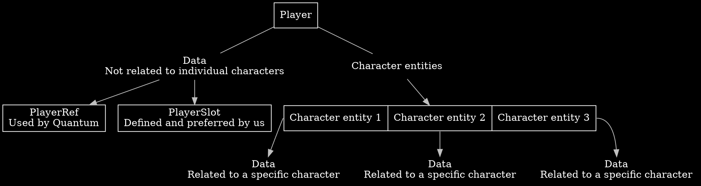
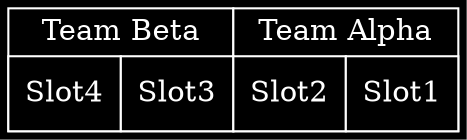
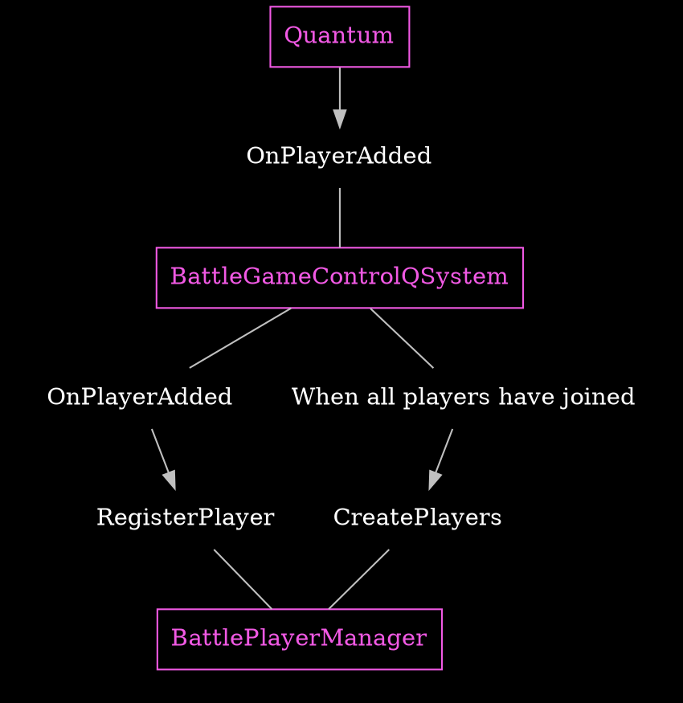
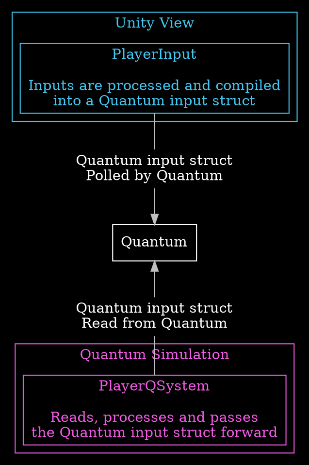
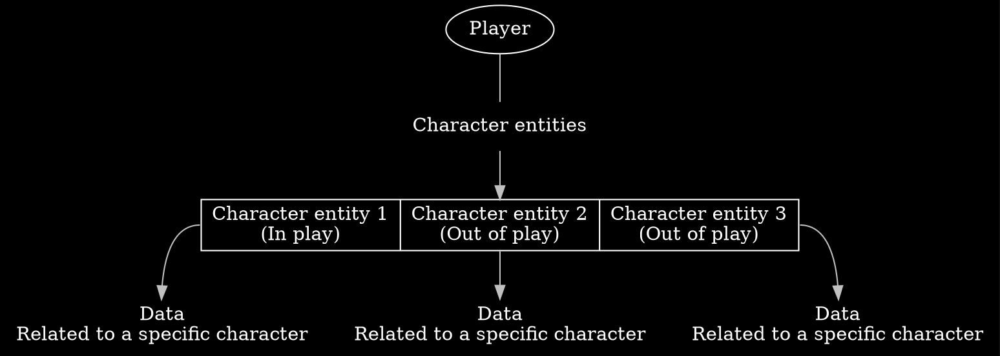
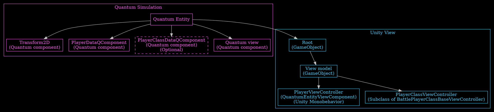
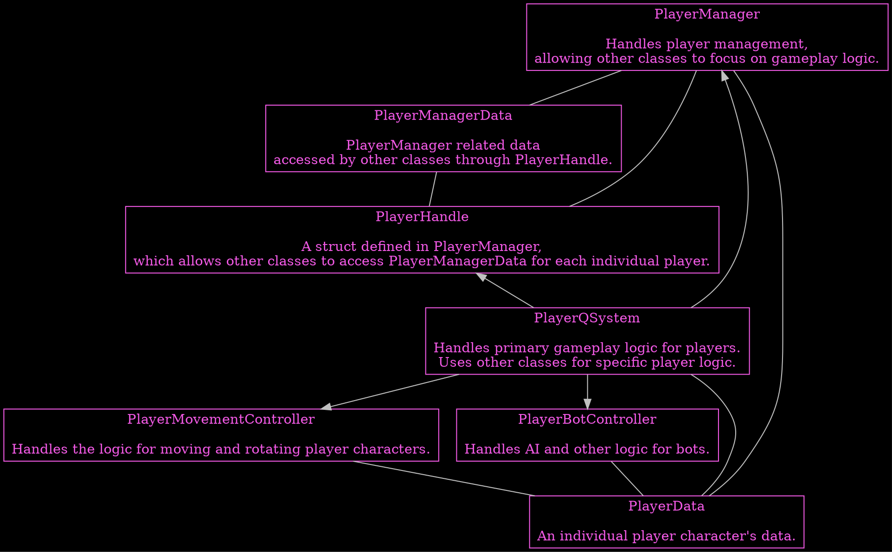
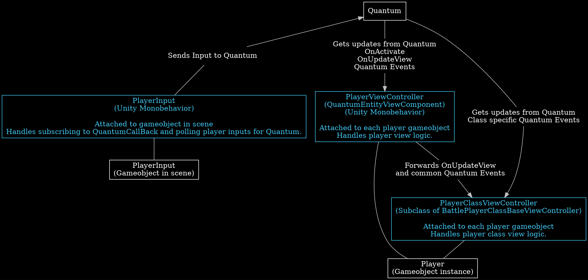

# Player {#page-concepts-player}

## Overview {#page-concepts-player-overview}
%Quantum handles recognizing **Players** through a [PlayerRef🡵](https://doc-api.photonengine.com/en/quantum/current/struct_quantum_1_1_player_ref.html),
but we prefer to use **PlayerSlot** as defined by us whenever possible.  
Each **Player** has an assigned **PlayerSlot** and a **TeamNumber**.  
Each **Player** has **data** with them that **isn't connected to any specific character** under the **Player**'s control.  
Each **Player** controls multiple **Character Entities** which also have some data associated with them.  
See [{Player Slots and Teams}](#page-concepts-player-slots-teams)  
See [{Player Manager Data}](#page-concepts-player-manager-data)  
See [{Player Character Entity}](#page-concepts-player-character-entity)

**Other topics**  
See [{Joining and initializing}](#page-concepts-player-initializing)  
See [{Player Input}](#page-concepts-player-input)  



## Player Slots and Teams {#page-concepts-player-slots-teams}
Each player has an assigned @cref{Quantum,BattlePlayerSlot} and a @cref{Quantum,BattleTeamNumber}.  
The possible slots are 1-4.  
The teams are TeamAlpha and TeamBeta.  
Players in slots 1 and 2 are in TeamAlpha and players in slots 3 and 4 in TeamBeta.  
Guest and Spectator slots also exist, but are not currently used in %Battle.  
The enums for player slots and teams are defined in [{Simulation}](#page-concepts-player-simulation).



<br/>

## Player Manager Data {#page-concepts-player-manager-data}
Player data not connected to individual player characters is handled by [{PlayerManager}](#page-concepts-player-simulation-playermanager).  
The [{PlayerManagerData}](#page-concepts-player-simulation-playermanagerdata) %Quantum singleton component is used to store player data.
The [{PlayerHandle}](#page-concepts-player-simulation-playerhandle) struct allows the code to access player manager data of specific individual players.  
Player manager data is defined and used in [{Simulation}](#page-concepts-player-simulation).

<br/>

## Joining and initializing {#page-concepts-player-initializing}
%Quantum handles players connecting to the game. The data from %Quantum is used to initialize everything related to players in the game.
@cref{Battle.QSimulation.Game,BattleGameControlQSystem} receives player information from %Quantum when a player joins and passes it
to [{PlayerManager}](#page-concepts-player-simulation-playermanager), which processes the player's data and registers them as having joined.

Once all players have joined, @cref{Battle.QSimulation.Game,BattleGameControlQSystem} tells [{PlayerManager}](#page-concepts-player-simulation-playermanager)
to create [{Player character entities}](#page-concepts-player-character-entity) for all players.



<br/>

## Player Input {#page-concepts-player-input}
Players can interact with the game through moving and rotating their character, as well as switching between their available characters.  
Player inputs are processed and compiled into a @ref Quantum.Input "Quantum input struct" on the Unity/View side in [{PlayerInput}](#page-concepts-player-view-input).
The created struct is passed over to %Quantum.  
%Quantum synchronises the struct for all connected clients, and classes on the [{Quantum simulation}](#page-concepts-player-simulation) side use the contained data.

See [Input🡵](https://doc.photonengine.com/quantum/current/manual/input) %Quantum's documentation for more info.



<br/>

## Player Character Entity {#page-concepts-player-character-entity}
Each player controls three character %Quantum entities in the game.  
For each player one character is present on the stage at a time and [{PlayerManager}](#page-concepts-player-simulation-playermanager) handles spawning and
despawning character entities when switching between them.



These entities are created based on Unity prefabs. Entities are controlled by **%Quantum Simulation**.  
The Unity prefab root GameObject contains a %Quantum entity prototype component, where the entity is defined.

During gameplay the player character exists both as a %Quantum entity inside [{Simulation}](#page-concepts-player-simulation) and a Unity gameObject inside **Unity View**.
%Quantum links the gameObject and entity together.

The entity contains %Quantum components used by the %Quantum simulation. The most significant of these is the [{PlayerData (Quantum component)}](#page-concepts-player-simulation-playerdata),
which is our own defined data relating to player character entities and optionally **Class Data Component**.  
See [{Player Character Classes}](#page-concepts-player-characters-classes)

The Unity root gameObject has the child object PlayerViewModel, containing all things related to the visible elements of player characters.
The attached [{PlayerViewController}](#page-concepts-player-view-controller) component implements **Unity View/Visual** logic for player characters.



<br/>

## Player Character Classes {#page-concepts-player-characters-classes}
In **%Quantum Simulation**, player character classes function by having implementable methods that are called in certain situations during a game,
such as when a projectile collides with a player character. Classes can also implement an update method.

In **Unity View**, player character classes function by having implementable methods that are called when certain events occur during a game,
such as when the player takes damage. Classes can also implement an update view method.

These methods can be used to implement functionality on top of the base logic, for example,
the default collision logic, and/or view update logic. Changing how different character classes function.

See [{PlayerClassManager}](#page-concepts-player-simulation-classmanager) for more info.  
See [{PlayerClass}](#page-concepts-player-simulation-playerclass) for more info.  
See [{PlayerClassData (Quantum component)}](#page-concepts-player-simulation-classdata) for more info.  
See [{PlayerClassViewControllers}](#page-concepts-player-view-class-controller) for more info.

<br/>

### Player Character Class List {#page-concepts-player-characters-class-list}

@subpage page-concepts-player-class-400-projector  
@subpage page-concepts-player-class-600-confluent

<br/>

---

<br/>

## %Quantum simulation {#page-concepts-player-simulation}

<br/>

### Simulation Code Overview {#page-concepts-player-simulation-overview}


<br/>

### PlayerManagerData (%Quantum singleton) {#page-concepts-player-simulation-playermanagerdata}
The @cref{Quantum,BattlePlayerManagerDataQSingleton} struct is a %Quantum singleton component defined in and generated from BattlePlayerManagerData.qtn
containing all our defined data for players. [{PlayerHandle}](#page-concepts-player-simulation-playerhandle) is used to access this data for each individual player.

<br/>

### PlayerManager {#page-concepts-player-simulation-playermanager}
The @cref{Battle.QSimulation.Player,BattlePlayerManager} handles player management, allowing other classes to focus on gameplay logic.  
Provides static methods to initialize, spawn, despawn, and query player-related data.  
Handles initializing players that are present in the game, as well as spawning and despawning player characters and
also contains [{Playerhandle}](#page-concepts-player-simulation-playerhandle) struct.

<br/>

### PlayerHandle {#page-concepts-player-simulation-playerhandle}
The @cref{Battle.QSimulation.Player.BattlePlayerManager,PlayerHandle} struct defined in [{PlayerManager}](#page-concepts-player-simulation-playermanager) allows
the code to access [{Player manager data}](#page-concepts-player-manager-data) of each individual player.

There is both a private @cref{Battle.QSimulation.Player.BattlePlayerManager,PlayerHandleInternal} struct containing all the data for use internally
within [{PlayerManager}](#page-concepts-player-simulation-playermanager), and the public @cref{Battle.QSimulation.Player.BattlePlayerManager,PlayerHandle}
exposing some parts to the rest of the game.

<br/>

### PlayerData (%Quantum component) {#page-concepts-player-simulation-playerdata}
The @cref{Quantum,BattlePlayerDataQComponent} struct is defined in and generated from BattlePlayerData.qtn.
This contains data specific to each [{Player character entity}](#page-concepts-player-character-entity) used by the %Quantum simulation during gameplay.

<br/>

### PlayerQSystem {#page-concepts-player-simulation-playerqsystem}
The @cref{Battle.QSimulation.Player,BattlePlayerQSystem} contains the primary %Quantum player logic.
This %Quantum system contains code for handling collisions and the update method for player characters.
Other classes are utilized for specific aspects of player logic.  
See [{PlayerMovementController}](#page-concepts-player-simulation-playerqsystem-movement-controller)  
See [{PlayerBotController}](#page-concepts-player-simulation-botcontroller)

<br/>

### PlayerMovementController {#page-concepts-player-simulation-playerqsystem-movement-controller}
The @cref{Battle.QSimulation.Player,BattlePlayerMovementController} contains the primary @cref{Battle.QSimulation.Player.BattlePlayerMovementController,UpdateMovement} method
which handles player movement, and is called by [{BattlePlayerQSystem}](#page-concepts-player-simulation-playerqsystem).
Also contains individual helper methods for moving and rotating players, which can be used by other scripts.

<br/>

### PlayerClassManager {#page-concepts-player-simulation-classmanager}

The @cref{Battle.QSimulation.Player,BattlePlayerClassManager} handles the initial loading of player classes and routes individual game events to the correct class scripts.  
See [{Player Character Classes}](#page-concepts-player-characters-classes)

<br/>

### PlayerClass {#page-concepts-player-simulation-playerclass}

Every player character class can optionally have a unique C# class that inherits one of the two base @cref{Battle.QSimulation.Player,BattlePlayerClassBase} classes
defined in BattlePlayerClassManager.cs. These classes can choose to implement any of the available methods for functionality.
Character classes can also optionally have a [{PlayerClassData}](#page-concepts-player-simulation-classdata) **QComponent** for additional data the class will use.
When a character class has a **data QComponent**, the C# class inherits the generic version of the base class using the **data QComponent** as the generic type parameter.  
As stated before the player C# class is optional and can be omitted for player character classes that need no additional simulation logic.

**C# code example**
```cs
// Without data QComponent
public class BattlePlayerClassExample1 : BattlePlayerClassBase
{
  // ...
}

// With data QComponent
public class BattlePlayerClassExample2 : BattlePlayerClassBase<BattlePlayerClassExample2DataQComponent>
{
  // ...
}
```

The C# classes are stateless and there is only one instance for each character class which are loaded and managed by [{PlayerClassManager}](#page-concepts-player-simulation-classmanager).  
Scripts such as [{PlayerQSystem}](#page-concepts-player-simulation-playerqsystem) call methods in [{PlayerClassManager}](#page-concepts-player-simulation-classmanager),
which then in turn call the corresponding method for the character class of the specified player character. This way each characters possible character class methods
are always correctly called.

See [{Player Character Classes}](#page-concepts-player-characters-classes)

<br/>

### PlayerClassData (%Quantum component) {#page-concepts-player-simulation-classdata}
Every player character class can optionally have a **data QComponent** for additional data the **class** will use.

**Qtn code example**
```
component BattlePlayerClassExample2DataQComponent
{
  // ...
}
```

The **data QComponents** are attached to the [{Player Character Entities}](#page-concepts-player-character-entity) which is used by the C# class of the corresponding character class.

See [{PlayerClass}](#page-concepts-player-simulation-playerclass)  
See [{Player Character Classes}](#page-concepts-player-characters-classes)

<br/>

### PlayerBotController {#page-concepts-player-simulation-botcontroller}
The @cref{Battle.QSimulation.Player,BattlePlayerBotController} Contains the @cref{Battle.QSimulation.Player.BattlePlayerBotController,GetBotInput} method
which handles bot movement logic, and is called by [{BattlePlayerQSystem}](#page-concepts-player-simulation-playerqsystem).  
Bots have a base character which is retrieved from @cref{Battle.QSimulation.Player,BattlePlayerBotQSpec}
using @cref{Battle.QSimulation.Player.BattlePlayerBotController,GetBotCharacters} method.  
In a match each bot uses three instances of the base character.

## View {#page-concepts-player-view}

<br/>

### View Code Overview {#page-concepts-player-view-overview}



<br/>

### PlayerInput {#page-concepts-player-view-input}
The @cref{Battle.View.Player,BattlePlayerInput} is processed and compiled into an input struct, which is passed over to the %Quantum simulation when polled by %Quantum.  
See [{Player Input}](#page-concepts-player-input) for more info.

<br/>

### PlayerViewController {#page-concepts-player-view-controller}
The @cref{Battle.View.Player,BattlePlayerViewController} handles player view logic.  
[{PlayerClassViewControllers}](#page-concepts-player-view-class-controller), which are tied to this C# class, handle character class specific view logic.

<br/>

### PlayerClassViewControllers {#page-concepts-player-view-class-controller}
Every player character class can optionally have a view controller which extends the @cref{Battle.View.Player,BattlePlayerClassBaseViewController}.
These view controllers can be optionally implemented and attached to player viewmodel in prefab.
The view controllers can choose to implement any of the available methods for functionality to handle character class view logic.  
If no player class view controller is attached then @cref{Battle.View.Player,BattlePlayerClassNoneViewController} is attached.  
As stated before the player class view controller is optional and can be omitted for player character classes that need no additional view logic.  
**PlayerClassViewControllers** are tied to [{PlayerViewController}](#page-concepts-player-view-controller).

**C# code example**
```cs
public class BattlePlayerClassExampleViewController : BattlePlayerClassBaseViewController
{
  // ...
}
```

See [{Player Character Classes}](#page-concepts-player-characters-classes) for more info.
