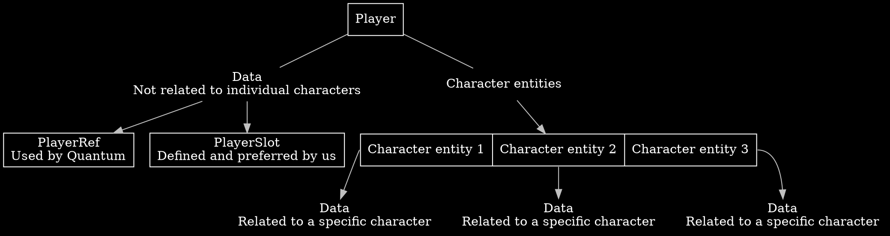
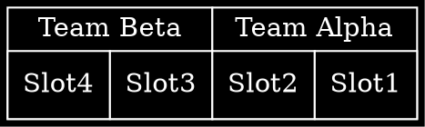
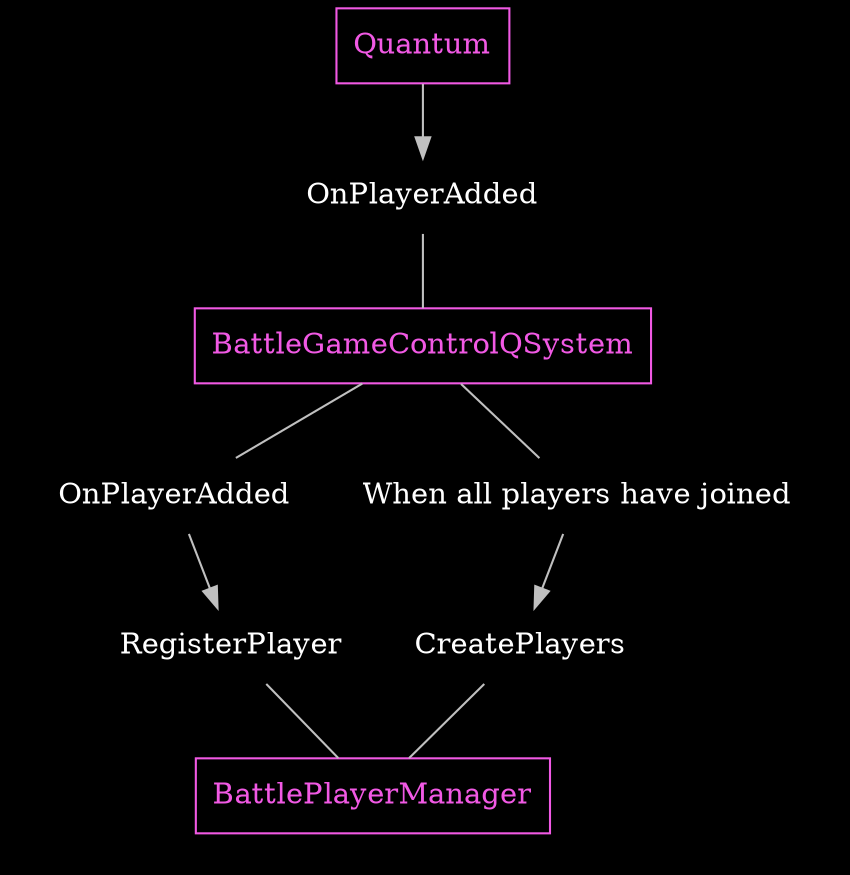
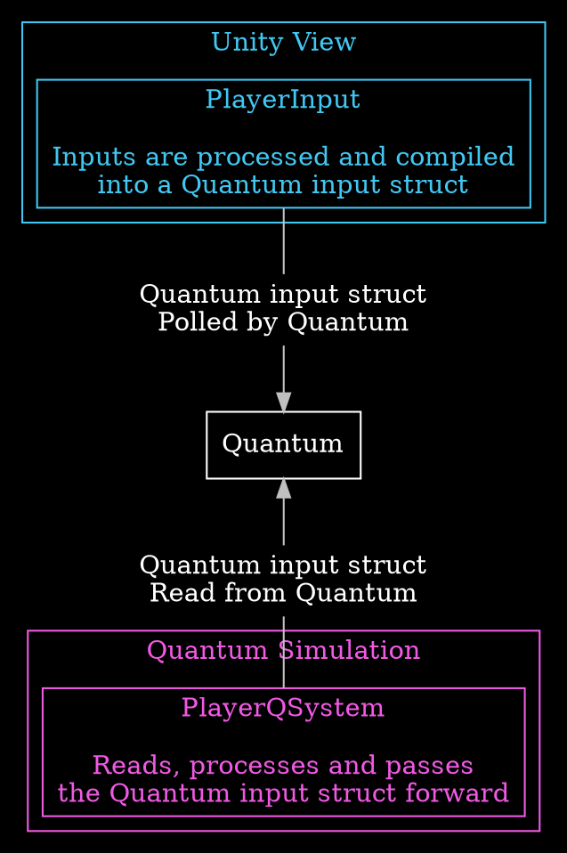
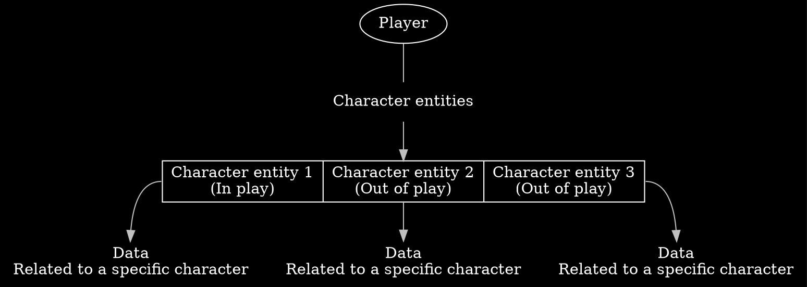
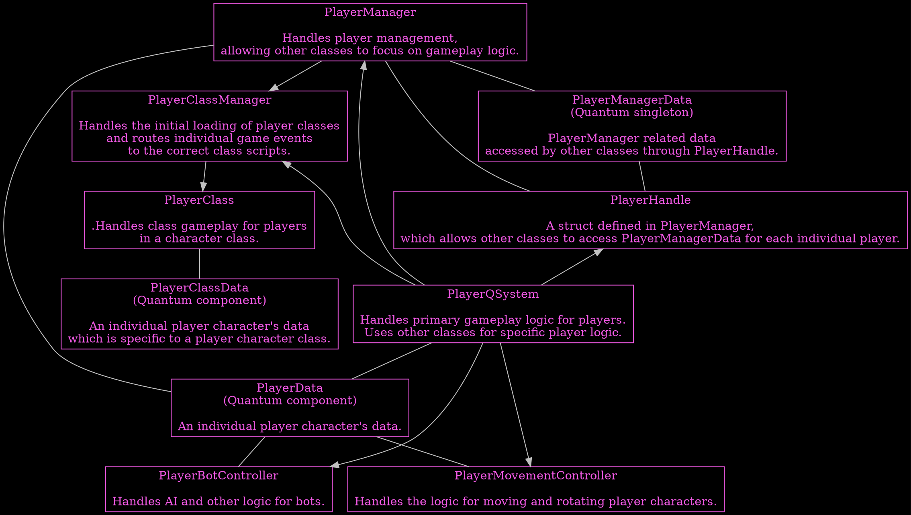

# Player {#page-concepts-player}

## Overview {#page-concepts-player-overview}

**%Quantum** handles recognizing **Players** through a [PlayerRef🡵](https://doc-api.photonengine.com/en/quantum/current/struct_quantum_1_1_player_ref.html),
but we prefer to use **PlayerSlot** as defined by us whenever possible.  
Each **Player** has an assigned **PlayerSlot** and a **TeamNumber**.  
Each Each **Player** has a **PlayState**.  
Each **Player** has **data** with them that **isn't connected to any specific character** under the **Player**'s control.  
Each **Player** controls multiple **Character Entities** which also have some data associated with them.  
Each **Character Entity** has a player character class that it belongs to.  
See [{Player Slots and Teams}](#page-concepts-player-slots-teams)  
See [{Player PlayState}](#page-concepts-player-playstate)  
See [{Player Manager Data}](#page-concepts-player-manager-data)  
See [{Player Character Entity}](#page-concepts-player-character-entity)  
See [{Player Character Classes}](#page-concepts-player-characters-classes)

**Other topics**  

See [{Joining and Initializing}](#page-concepts-player-initializing)  
See [{Player Input}](#page-concepts-player-input)  



## Player Slots and Teams {#page-concepts-player-slots-teams}

Each **Player** has an assigned @cref{Quantum,BattlePlayerSlot} and a @cref{Quantum,BattleTeamNumber}.  
The possible **Slots** are **1-4**.  
The **Teams** are **TeamAlpha** and **TeamBeta**.  
**Players** in **Slots** **1** and **2** are in **TeamAlpha** and **Players** in **Slots** **3** and **4** in **TeamBeta**.  
**Guest** and **Spectator** slots also exist, but are not currently used in %Battle.  
The enums for **Player Slots** and **Teams** are defined in [{Quantum Simulation}](#page-concepts-player-simulation).



<br/>

## Player PlayState {#page-concepts-player-playstate}

Each **Player** has a @cref{Quantum,BattlePlayerPlayState} used to track their state in the game, which is detached from [{Player Character Entities}](#page-concepts-player-character-entity) that the **Player** controls.  
The **PlayStates** are linked to [{Player Slots}](#page-concepts-player-slots-teams) including slots that have no player.

<br/>

## Player Manager Data {#page-concepts-player-manager-data}

**Player data** not connected to individual [{Player Character Entities}](#page-concepts-player-character-entity) is handled
by [{PlayerManager}](#page-concepts-player-simulation-playermanager).  
The [{PlayerManagerData}](#page-concepts-player-simulation-playermanagerdata) **%Quantum Singleton Component** is used to store **Player Data**.  
The [{PlayerHandle}](#page-concepts-player-simulation-playerhandle) struct allows the code to access **Player Manager Data** of specific individual **Players**.  
**Player Manager Data** is defined and used in [{Simulation}](#page-concepts-player-simulation).

<br/>

## Joining and Initializing {#page-concepts-player-initializing}

**%Quantum** handles **Players** connecting to the game. The data from **%Quantum** is used to initialize everything related to **Players** in the game.
@cref{Battle.QSimulation.Game,BattleGameControlQSystem} receives **Player** information from **%Quantum** when a **Player** joins and passes it
to [{PlayerManager}](#page-concepts-player-simulation-playermanager), which processes the **Player**'s data and registers them as having joined.

Once all **Players** have joined, @cref{Battle.QSimulation.Game,BattleGameControlQSystem} tells [{PlayerManager}](#page-concepts-player-simulation-playermanager)
to create [{Player Character Entities}](#page-concepts-player-character-entity) for all **Players**.



<br/>

## Player Input {#page-concepts-player-input}

**Players** can interact with the game through moving and rotating their [{Player Character Entity}](#page-concepts-player-character-entity),
as well as switching between their available [{Player Character Entities}](#page-concepts-player-character-entity).  
**Player Inputs** are processed and compiled into a @ref Quantum.Input "Quantum Input Struct" on the **Unity/View** side in [{PlayerInput}](#page-concepts-player-view-input).
The created **struct** is passed over to **%Quantum Simulation**.  
**%Quantum** synchronises the **struct** for all connected **clients**, and classes on the [{Quantum Simulation}](#page-concepts-player-simulation) side use the contained data.

See [Input🡵](https://doc.photonengine.com/quantum/current/manual/input) **%Quantum**'s documentation for more info.



<br/>

## Player Character Entity {#page-concepts-player-character-entity}

Each **Player** controls **3** **Character %Quantum Entities** in the game.  
For each **Player** one **Character** and it's **Shield(s)** are present on the stage at a time and [{PlayerManager}](#page-concepts-player-simulation-playermanager) and [{ShieldManager}](#page-concepts-player-simulation-shieldmanager) handle spawning and
despawning **Character and Shield Entities** when switching between them.  
Each **Character and Shield Entity** has a [{Player Character Class}](#page-concepts-player-characters-classes) that it belongs to.



These **Entities** are created based on **Unity Prefabs**. **Entities** are controlled by **%Quantum Simulation**.
The **Unity Prefab root GameObject** contains a **%Quantum Entity Prototype** component, where the **Entity** is defined.

During gameplay the **Player Character** and it's **Shield(s)** exists both as a **%Quantum Entity** inside [{Quantum Simulation}](#page-concepts-player-simulation) and a **Unity GameObject** inside **Unity View**,
which **%Quantum** links together.

The **Entity** contains **%Quantum Components** used by the **%Quantum Simulation**. The most significant of these is the [{PlayerData}](#page-concepts-player-simulation-playerdata),
which is our own defined data relating to **Player Character and Shield Entities** and optionally **Class Data Component**.

See [{Player Character Classes}](#page-concepts-player-characters-classes) for more info.

The **Unity root GameObject** has the child object **PlayerViewModel** ,or **ShieldViewModel** for **Shields**, containing all things related to the visible elements of **Player Characters and Shields**.  
The attached [{PlayerCharacterViewController}](#page-concepts-player-character-view-controller) or [{PlayerShieldViewController}](#page-concepts-player-shield-view-controller) component implements **Unity View / Visual** logic for **Player Characters and Shields**.

```dot
digraph PlayerCharacterEntity {
  color=white;
  fontcolor=white;
  bgcolor=black;


  edge [color=gray];

  subgraph cluster_quantum {
    color="#F159E4";
    fontcolor="#F159E4";
    label = "Quantum Simulation";

    node [shape=box, style=filled, color="#F159E4", fontcolor="#F159E4", fillcolor=black];

    Entity          [label="Quantum Entity"];
    Transform2D     [label="Transform2D\n(Quantum component)"];
    PlayerData      [label="PlayerDataQComponent\n(Quantum component)"];
    PlayerClassData [label="PlayerClassDataQComponent\n(Quantum component)\n(Optional)", style=dashed];
    View            [label="Quantum view\n(Quantum component)"];

    Entity -> Transform2D, PlayerData, PlayerClassData, View;
  }

  subgraph cluster_unity_character {
    color="#41C7F1";
    fontcolor="#41C7F1";
    label = "Unity Character View";

    node [shape=box, style=filled, color="#41C7F1", fontcolor="#41C7F1", fillcolor=black];

    CharacterRootGameObject                     [label="Root\n(GameObject)"];
    CharacterViewModel                          [label="View model\n(GameObject)"];
    PlayerCharacterViewController      [label="PlayerCharacterViewController\n(QuantumEntityViewComponent)\n(Unity Monobehavior)"];
    PlayerCharacterClassViewController [label="PlayerCharacterClassViewController\n(Subclass of BattlePlayerCharacterClassBaseViewController)"];

    CharacterRootGameObject -> CharacterViewModel -> PlayerCharacterViewController, PlayerCharacterClassViewController;
  }

  subgraph cluster_unity_shield {
    color="#41C7F1";
    fontcolor="#41C7F1";
    label = "Unity Shield View";

    node [shape=box, style=filled, color="#41C7F1", fontcolor="#41C7F1", fillcolor=black];

    ShieldRootGameObject                  [label="Root\n(GameObject)"];
    ShieldViewModel                       [label="View model\n(GameObject)"];
    PlayerShieldViewController      [label="PlayerShieldViewController\n(QuantumEntityViewComponent)\n(Unity Monobehavior)"];
    PlayerShieldClassViewController [label="PlayerShieldClassViewController\n(Subclass of BattlePlayerShieldClassBaseViewController)"];

    ShieldRootGameObject -> ShieldViewModel -> PlayerShieldViewController, PlayerShieldClassViewController;
  }

  Entity -> CharacterRootGameObject, ShieldRootGameObject;
}
```



<br/>

### Player Character Number {#page-concepts-player-character-entity-character-number}

Each **Character %Quantum Entity** is internally assigned a **character number** between 0 and 2, each corresponding to one of the **3 Characters** a **Player** controls. It is used to reference a specific **Character** for a given **Player**.

<br/>

### Player Character State {#page-concepts-player-character-entity-character-state}

Each **Character %Quantum Entity** always has a @cref{Quantum,BattlePlayerCharacterState} indicating if the **Character** is **Alive** or **Dead**.

<br/>

## Player Character Classes {#page-concepts-player-characters-classes}

@bigtext{**Explanation**}

In **%Quantum Simulation**, **Player Character Classes** function by having implementable methods that are called in certain situations during a game,
such as when a projectile collides with a [{Player Character Entity}](#page-concepts-player-character-entity). **Classes** can also implement an update method.

In **Unity View**, **Player Character Classes** function by having implementable methods that are called when certain events occur during a game,
such as when the player takes damage. **Classes** can also implement an update view method.

These methods can be used to implement functionality on top of the base logic, for example
the default collision logic and/or **Unity/View** update logic, changing how different **Character Classes** function.

@bigtext{**Implementation**}

In **%Quantum Simulation**, every **Player Character Class** can optionally have a unique **C#** [{PlayerClass}](#page-concepts-player-simulation-playerclass).  
**Character Classes** can also optionally have a [{PlayerClassData}](#page-concepts-player-simulation-classdata) **QComponent**
attached to the [{Player Character Entities}](#page-concepts-player-character-entity) for additional data the **Class** will use.  
The **C#** [{PlayerClass}](#page-concepts-player-simulation-playerclass) are stateless and
there is only one instance for each **Character Class**. These are loaded and managed by [{PlayerClassManager}](#page-concepts-player-simulation-classmanager).

In **Unity View**, every **Player Character class** can optionally have a [{PlayerClassViewController}](#page-concepts-player-view-class-controller).

<br/>

### Player Character Class List {#page-concepts-player-characters-class-list}

@subpage page-concepts-player-class-400-projector  
@subpage page-concepts-player-class-600-confluent

<br/>

---

<br/>

## %Quantum simulation {#page-concepts-player-simulation}

<br/>

### Simulation Code Overview {#page-concepts-player-simulation-overview}


<br/>

### PlayerManagerData (%Quantum Singleton) {#page-concepts-player-simulation-playermanagerdata}

The @cref{Quantum,BattlePlayerManagerDataQSingleton} struct is a **%Quantum Singleton Component** defined in and generated from BattlePlayerManagerData.qtn
containing all our defined data for **Players**. [{PlayerHandle}](#page-concepts-player-simulation-playerhandle) is used to access this data for each individual **Player**.

<br/>

### PlayerManager {#page-concepts-player-simulation-playermanager}

The @cref{Battle.QSimulation.Player,BattlePlayerManager} handles player management, allowing other classes to focus on gameplay logic.  
Provides static methods to **Initialize**, spawn, despawn, and query player-related data.  
Handles **Initializing Players** that are present in the game, as well as spawning and despawning [{Player Character Entities}](#page-concepts-player-character-entity) and
also contains [{Playerhandle}](#page-concepts-player-simulation-playerhandle) struct.

See [{Joining and Initializing}](#page-concepts-player-initializing) for more info.

<br/>

### PlayerHandle {#page-concepts-player-simulation-playerhandle}

The @cref{Battle.QSimulation.Player.BattlePlayerManager,PlayerHandle} struct defined in [{PlayerManager}](#page-concepts-player-simulation-playermanager) allows
the code to access [{Player Manager Data}](#page-concepts-player-manager-data) of each individual **Player**.

There is both a **private** @cref{Battle.QSimulation.Player.BattlePlayerManager,PlayerHandleInternal} struct containing all the data for **use internally**
within [{PlayerManager}](#page-concepts-player-simulation-playermanager), and the **public** @cref{Battle.QSimulation.Player.BattlePlayerManager,PlayerHandle}
exposing some parts to the **rest of the game**.

<br/>

### PlayerData (%Quantum Component) {#page-concepts-player-simulation-playerdata}

The @cref{Quantum,BattlePlayerDataQComponent} struct is defined in and generated from BattlePlayerData.qtn.
This contains data specific to each [{Player Character Entity}](#page-concepts-player-character-entity) used by the **%Quantum Simulation** during gameplay.

<br/>

### PlayerQSystem {#page-concepts-player-simulation-playerqsystem}

The @cref{Battle.QSimulation.Player,BattlePlayerQSystem} contains the primary **%Quantum** **Player** logic.
This **%Quantum System** contains code for handling collisions and the update method for [{Player Character Entities}](#page-concepts-player-character-entity).
Other classes are utilized for specific aspects of **Player** logic.

See [{PlayerMovementController}](#page-concepts-player-simulation-playerqsystem-movement-controller) for more info.  
See [{PlayerBotController}](#page-concepts-player-simulation-botcontroller) for more info.

<br/>

### PlayerMovementController {#page-concepts-player-simulation-playerqsystem-movement-controller}

The @cref{Battle.QSimulation.Player,BattlePlayerMovementController} contains the primary @cref{Battle.QSimulation.Player.BattlePlayerMovementController,UpdateMovement} method
which handles **Player** movement, and is called by [{BattlePlayerQSystem}](#page-concepts-player-simulation-playerqsystem).
Also contains individual helper methods for moving and rotating [{Player Character Entities}](#page-concepts-player-character-entity), which can be used by other scripts.

<br/>

### PlayerClassManager {#page-concepts-player-simulation-classmanager}

The @cref{Battle.QSimulation.Player,BattlePlayerClassManager} handles the initial loading of [{PlayerClasses}](#page-concepts-player-simulation-playerclass)
and routes individual game events to the correct **Class** scripts.  
The [{PlayerClasses}](#page-concepts-player-simulation-playerclass) are stateless and there is only one instance loaded at a time.  
Scripts such as [{PlayerQSystem}](#page-concepts-player-simulation-playerqsystem) call methods in **PlayerClassManager**,
which then in turn call the corresponding method for the **Character Class** of the specified [{Player Character Entity}](#page-concepts-player-character-entity).

See [{Player Character Classes}](#page-concepts-player-characters-classes) for more info.

<br/>

### PlayerClass {#page-concepts-player-simulation-playerclass}

Every **Player Character Class** can optionally have a unique **C# class** that inherits one of the two base @cref{Battle.QSimulation.Player,BattlePlayerClassBase} classes
defined in BattlePlayerClassManager.cs. These classes can choose to implement any of the available methods for functionality.
**Character Classes** can also optionally have a [{PlayerClassData}](#page-concepts-player-simulation-classdata) **QComponent** for additional data.
When a **Character Class** has a **Data QComponent**, the **C# class** inherits the generic version of the base class using the **Data QComponent** as the generic type parameter.  
As stated before the **C# class** is optional and can be omitted for **Player Character Classes** that need no additional **%Quantum Simulation** logic.

**C# code example**
```cs
// Without data QComponent
public class BattlePlayerClassExample1 : BattlePlayerClassBase
{
  // ...
}

// With data QComponent
public class BattlePlayerClassExample2 : BattlePlayerClassBase<BattlePlayerClassExample2DataQComponent>
{
  // ...
}
```

The **C# classes** are stateless and there is only one instance for each **Character Class**
which are loaded and managed by [{PlayerClassManager}](#page-concepts-player-simulation-classmanager).  
Scripts such as [{PlayerQSystem}](#page-concepts-player-simulation-playerqsystem) call methods in [{PlayerClassManager}](#page-concepts-player-simulation-classmanager),
which then in turn call the corresponding method for the **Character Class** of the specified [{Player Character Entity}](#page-concepts-player-character-entity).
This way each **Player Characters** possible **Character Class** methods are always correctly called.

See [{Player Character Classes}](#page-concepts-player-characters-classes) for more info.

<br/>

### PlayerClassData (%Quantum Component) {#page-concepts-player-simulation-classdata}

Every **Player Character Class** can optionally have a **Data QComponent** for additional data.

**Qtn code example**
```
component BattlePlayerClassExample2DataQComponent
{
  // ...
}
```

The **Data QComponents** are attached to the [{Player Character Entities}](#page-concepts-player-character-entity) and are used by the **C# class** of the corresponding **Character Class**.

See [{PlayerClass}](#page-concepts-player-simulation-playerclass) for more info.  
See [{Player Character Classes}](#page-concepts-player-characters-classes) for more info.

<br/>

### PlayerBotController {#page-concepts-player-simulation-botcontroller}

The @cref{Battle.QSimulation.Player,BattlePlayerBotController} contains the @cref{Battle.QSimulation.Player.BattlePlayerBotController,GetBotInput} method
which handles **Bot** movement logic, and is called by [{BattlePlayerQSystem}](#page-concepts-player-simulation-playerqsystem).  
**Bots** have a **base character** which is retrieved from @cref{Battle.QSimulation.Player,BattlePlayerBotQSpec}
using @cref{Battle.QSimulation.Player.BattlePlayerBotController,GetBotCharacters} method.  
In a match each **Bot** uses **3** instances of the **base character**.

## View {#page-concepts-player-view}

<br/>

### View Code Overview {#page-concepts-player-view-overview}

The **Unity/View** code is separated into **Character** and **Shield** logic.  
Any **Character** related logic will start with **BattlePlayerCharacter**, while any **Shield** related logic will start with **BattlePlayerShield**.  
The term **Character class** will be used in both **Character** and **Shield** logic, and should not be confused with **Character** logic.

```dot
digraph PlayerView {
  color=white;
  fontcolor=white;
  bgcolor=black;

  node [shape=box, style=filled, color=white, fontcolor=white, fillcolor=black];
  edge [color=gray];

  Quantum                            [label="Quantum"];
  PlayerInputGameobject              [label="PlayerInput\n(Gameobject in scene)"];

  node [color="#41C7F1", fontcolor="#41C7F1"];

  PlayerInput     [label="PlayerInput\n\(Unity Monobehavior)\n\nAttached to gameobject in scene\nHandles subscribing to QuantumCallBack and polling player inputs for Quantum."];

  node [color=transparent, fontcolor=white];

  InputLink       [label="Sends Input to Quantum"];

  subgraph cluster_character {
    color="#41C7F1";
    fontcolor="#41C7F1";
    label = "Character View";

    node [shape=box, style=filled, color=white, fontcolor=white, fillcolor=black];

    PlayerCharacterGameobject          [label="PlayerCharacter\n(Gameobject instance)"];

    node [color=transparent, fontcolor=white];

    UpdateCharacterLink                [label="Gets updates from Quantum\nOnActivate\nOnUpdateView\nQuantum Events"];
    ClassPlayerCharacterLink           [label="Forwards OnUpdateView\nand common Quantum Events"];
    ClassCharacterQuantumLink          [label="Gets updates from Quantum\nClass specific Quantum Events"];

    node [color="#41C7F1", fontcolor="#41C7F1"];

    PlayerCharacterViewController               [label="PlayerCharacterViewController\n(QuantumEntityViewComponent)\n(Unity Monobehavior)\n\nAttached to each player character gameobject\nHandles player character view logic."];
    PlayerCharacterClassViewController          [label="PlayerCharacterClassViewController\n(Subclass of BattlePlayerCharacterClassBaseViewController)\n\nAttached to each player character gameobject\nHandles player character class view logic."];

    UpdateCharacterLink -> PlayerCharacterViewController [dir=forward];
    PlayerCharacterViewController -> ClassPlayerCharacterLink [dir=none];
    ClassPlayerCharacterLink, ClassCharacterQuantumLink -> PlayerCharacterClassViewController [dir=forward];
    PlayerCharacterViewController, PlayerCharacterClassViewController -> PlayerCharacterGameobject [dir=none];
  }

  subgraph cluster_shield {
    color="#41C7F1";
    fontcolor="#41C7F1";
    label = "Shield View";

    node [shape=box, style=filled, color=white, fontcolor=white, fillcolor=black];

    PlayerShieldGameobject             [label="PlayerShield\n(Gameobject instance)"];

    node [color=transparent, fontcolor=white];

    UpdateShieldLink                [label="Gets updates from Quantum\nOnActivate\nOnUpdateView\nQuantum Events"];
    ClassPlayerShieldLink           [label="Forwards OnUpdateView\nand common Quantum Events"];
    ClassShieldQuantumLink          [label="Gets updates from Quantum\nClass specific Quantum Events"];

    node [color="#41C7F1", fontcolor="#41C7F1"];

    PlayerShieldViewController                  [label="PlayerShieldViewController\n(QuantumEntityViewComponent)\n(Unity Monobehavior)\n\nAttached to each player shield gameobject\nHandles player shield view logic."];
    PlayerShieldClassViewController             [label="PlayerShieldClassViewController\n(Subclass of BattlePlayerShieldClassBaseViewController)\n\nAttached to each player shield gameobject\nHandles player shield class view logic."];

    UpdateShieldLink -> PlayerShieldViewController [dir=forward];
    PlayerShieldViewController -> ClassPlayerShieldLink [dir=none];
    ClassPlayerShieldLink, ClassShieldQuantumLink -> PlayerShieldClassViewController [dir=forward];
    PlayerShieldViewController, PlayerShieldClassViewController -> PlayerShieldGameobject [dir=none];
  }

  Quantum -> InputLink [dir=back];

  edge [dir=none];

  InputLink -> PlayerInput;
  PlayerInput -> PlayerInputGameobject;
  Quantum -> UpdateCharacterLink, UpdateShieldLink;
  Quantum -> ClassCharacterQuantumLink, ClassShieldQuantumLink;
}
```


<br/>

### PlayerInput {#page-concepts-player-view-input}

The @cref{Battle.View.Player,BattlePlayerInput} is processed and compiled into an @ref Quantum.Input "Quantum Input Struct",
which is passed over to the **%Quantum Simulation** when polled by **%Quantum**.

See [{Player Input}](#page-concepts-player-input) for more info.

<br/>

### PlayerCharacterViewController {#page-concepts-player-character-view-controller}

The @cref{Battle.View.Player,BattlePlayerCharacterViewController} handles **Player Character** **Unity/View** logic.  
[{PlayerCharacterClassViewControllers}](#page-concepts-player-view-character-class-controller), which are tied to this **C# class**,
handle [{Player Character Class}](#page-concepts-player-characters-classes) specific **Unity/View** logic.  

<br/>

### PlayerCharacterClassViewControllers {#page-concepts-player-view-character-class-controller}

Every **Player Character Class** can optionally have a **Character View Controller** which extends the @cref{Battle.View.Player,BattlePlayerCharacterClassBaseViewController}.  
These **Character View Controllers** can be optionally implemented and attached to **Player character viewmodel** in prefab.  
The **Character View Controllers** can choose to implement any of the available methods for functionality to handle **Character Class** **Unity/View** logic.  
If no **PlayerCharacterClassViewController** is attached then @cref{Battle.View.Player,BattlePlayerCharacterClassNoneViewController} is attached.  
As stated before the **PlayerCharacterClassViewController** is optional and can be omitted for **Player Character Classes** that need no additional **Unity/View** logic.  
**PlayerCharacterClassViewControllers** are tied to [{PlayerCharacterViewController}](#page-concepts-player-character-view-controller).

**C# code example**
```cs
public class BattlePlayerCharacterClassExampleViewController : BattlePlayerCharacterClassBaseViewController
{
  // ...
}
```

### PlayerShieldViewController {#page-concepts-player-shield-view-controller}

The @cref{Battle.View.Player,BattlePlayerShieldViewController} handles **Player Shield** **Unity/View** logic.  
[{PlayerShieldClassViewControllers}](#page-concepts-player-view-shield-class-controller), which are tied to this **C# class**,
handle [{Player Character Class}](#page-concepts-player-characters-classes) specific **Unity/View** logic.  

<br/>

### PlayerShieldClassViewControllers {#page-concepts-player-view-shield-class-controller}

Every **Player Character Class** can optionally have a **Shield View Controller** which extends the @cref{Battle.View.Player,BattlePlayerShieldClassBaseViewController}.  
These **Shield View Controllers** can be optionally implemented and attached to **Player shield viewmodel** in prefab.  
The **Shield View Controllers** can choose to implement any of the available methods for functionality to handle **Character Class** **Unity/View** logic.  
If no **PlayerShieldClassViewController** is attached then @cref{Battle.View.Player,BattlePlayershieldClassNoneViewController} is attached.  
As stated before the **PlayerShieldClassViewController** is optional and can be omitted for **Player Character Classes** that need no additional **Unity/View** logic.  
**PlayerShieldViewControllers** are tied to [{PlayerShieldViewController}](#page-concepts-player-shield-view-controller).

**C# code example**
```cs
public class BattlePlayerShieldClassExampleViewController : BattlePlayerShieldClassBaseViewController
{
  // ...
}
```

See [{Player Character Classes}](#page-concepts-player-characters-classes) for more info.
