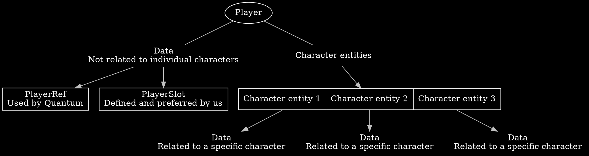
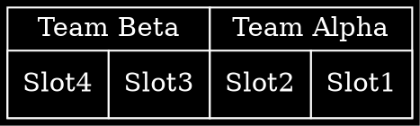
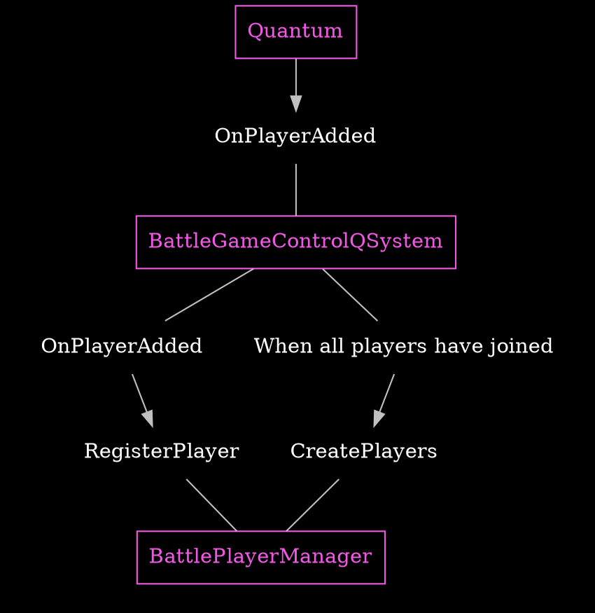
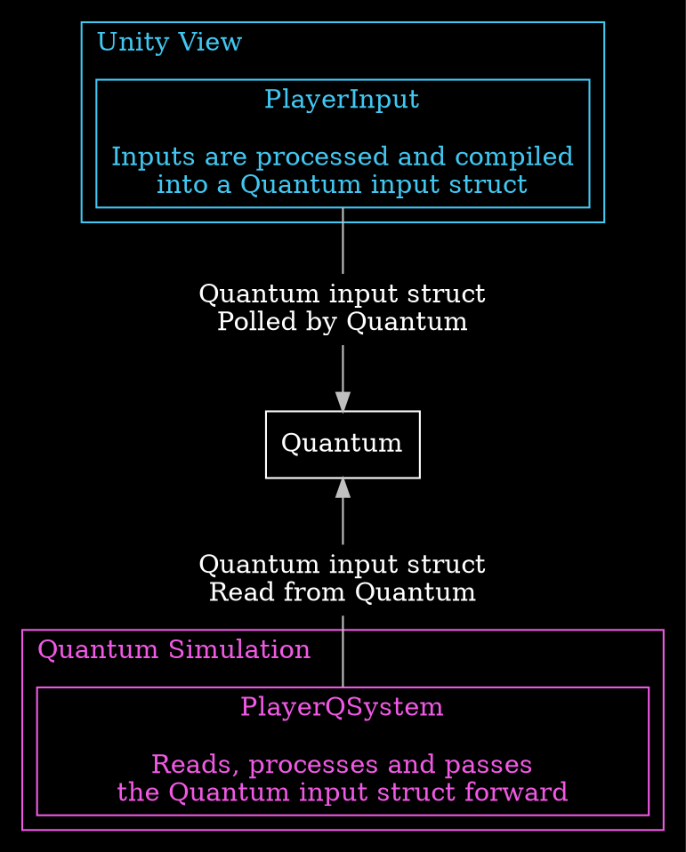
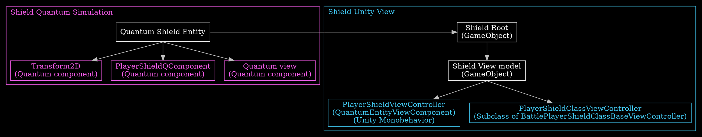
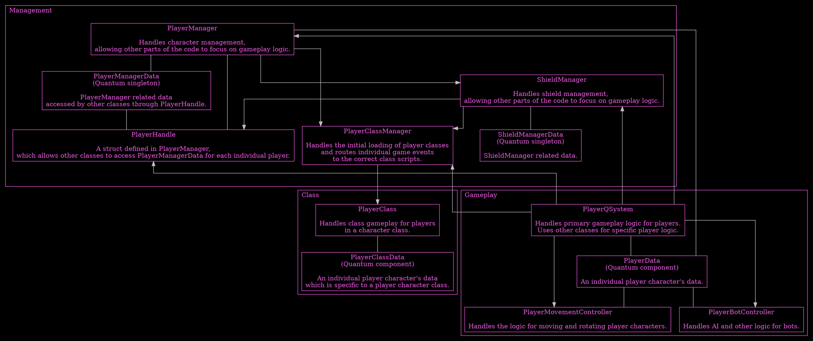

# Player {#page-concepts-player}

## Overview {#page-concepts-player-overview}

**%Quantum** handles recognizing **Players** through a [PlayerRef🡵](https://doc-api.photonengine.com/en/quantum/current/struct_quantum_1_1_player_ref.html),
but we prefer to use **PlayerSlot** as defined by us whenever possible.  
Each **Player** has an assigned **PlayerSlot** and a **TeamNumber**.  
Each Each **Player** has a **PlayState**.  
Each **Player** has **data** with them that **isn't connected to any specific character** under the **Player**'s control.  
Each **Player** controls multiple **Character Entities** which also have some data associated with them.  
Each **Character Entity** has a player character class that it belongs to.  
Each **Character Entity** has one or more **Shield Entities**.  
See [{Player Slots and Teams}](#page-concepts-player-slots-teams)  
See [{Player PlayState}](#page-concepts-player-playstate)  
See [{Player Manager Data}](#page-concepts-player-manager-data)  
See [{Player Character and Shield Entities}](#page-concepts-player-character-and-shield-entity)  
See [{Player Character Classes}](#page-concepts-player-characters-classes)

**Other topics**  

See [{Joining and Initializing}](#page-concepts-player-initializing)  
See [{Player Input}](#page-concepts-player-input)  

**Other sections**  

See [{Quantum Simulation}](#page-concepts-player-simulation)  
See [{View}](#page-concepts-player-view)


```dot
digraph Player {
  color=white;
  fontcolor=white;
  bgcolor=black;
  splines=polyline;

  node [shape=box, style=filled, color=white, fontcolor=white, fillcolor=black];
  edge [color=gray];

  Player              [label="Player", shape=ellipse];
  Data                [label="Data\nNot related to individual characters", color="transparent"];
  PlayerRef           [label="PlayerRef\nUsed by Quantum"];
  PlayerSlot          [label="PlayerSlot\nDefined and preferred by us"];
  CharacterEntities   [label="Character entities", color="transparent"];
  CharacterEntityList [label="<0> Character entity 1 | <1> Character entity 2 | <2> Character entity 3", shape=record];

  node [color="transparent"];

  CharacterData1      [label="Data\nRelated to a specific character"];
  CharacterData2      [label="Data\nRelated to a specific character"];
  CharacterData3      [label="Data\nRelated to a specific character"];

  Player -> Data,CharacterEntities [dir=none];
  Data -> PlayerRef, PlayerSlot;
  CharacterEntities -> CharacterEntityList;
  CharacterEntityList:0:s -> CharacterData1;
  CharacterEntityList:1:s -> CharacterData2;
  CharacterEntityList:2:s -> CharacterData3;
}
```

## Player Slots and Teams {#page-concepts-player-slots-teams}

Each **Player** has an assigned @cref{Quantum,BattlePlayerSlot} and a @cref{Quantum,BattleTeamNumber}.  
The possible **Slots** are **1-4**.  
The **Teams** are **TeamAlpha** and **TeamBeta**.  
**Players** in **Slots** **1** and **2** are in **TeamAlpha** and **Players** in **Slots** **3** and **4** in **TeamBeta**.  
**Guest** and **Spectator** slots also exist, but are not currently used in %Battle.  
The enums for **Player Slots** and **Teams** are defined in [{Quantum Simulation}](#page-concepts-player-simulation).


```dot
graph PlayerSlotsAndTeams {
  layout=osage;
  color=white;
  fontcolor=white;
  bgcolor=black;
  pack=0;

  node [shape=box, style=filled, color=white, fontcolor=white, fillcolor=black];

  subgraph cluster_beta {
    label="Team Beta";
    Slot4
    Slot3
  }

  subgraph cluster_alpha {
    label="Team Alpha";
    Slot2
    Slot1
  }
}
```

<br/>

## Player PlayState {#page-concepts-player-playstate}

This concept extends the more general [{PlayState}](#page-concepts-entity-management-registered-entities-playstate) concept. However, this is tracked explicitly.  
Each **Player** has a @cref{Quantum,BattlePlayerPlayState} used to track their state in the game, which is detached from [{Player Character Entities}](#page-concepts-player-character-and-shield-entity) that the **Player** controls.  
Each [{PlayerSlot}](#page-concepts-player-slots-teams) has a **Player PlayState** associated with it including slots that have no player.  
The general [{PlayState}](#page-concepts-entity-management-registered-entities-playstate) applies to the individual [{Player Character And Shield Entities}](#page-concepts-player-character-and-shield-entity).

<br/>

## Player Manager Data {#page-concepts-player-manager-data}

**Player data** not connected to individual [{Player Character Entities}](#page-concepts-player-character-and-shield-entity) is handled
by [{PlayerManager}](#page-concepts-player-simulation-management-playermanager).  
The [{PlayerManagerData}](#page-concepts-player-simulation-management-playermanagerdata) **%Quantum Singleton Component** is used to store **Player Data**.  
The [{PlayerHandle}](#page-concepts-player-simulation-management-playerhandle) struct allows the code to access **Player Manager Data** of specific individual **Players**.  
**Player Manager Data** is defined and used in [{Simulation}](#page-concepts-player-simulation).

<br/>

## Joining and Initializing {#page-concepts-player-initializing}

**%Quantum** handles **Players** connecting to the game. The data from **%Quantum** is used to initialize everything related to **Players** in the game.
@cref{Battle.QSimulation.Game,BattleGameControlQSystem} receives **Player** information from **%Quantum** when a **Player** joins and passes it
to [{PlayerManager}](#page-concepts-player-simulation-management-playermanager), which processes the **Player**'s data and registers them as having joined.

Once all **Players** have joined, @cref{Battle.QSimulation.Game,BattleGameControlQSystem} tells [{PlayerManager}](#page-concepts-player-simulation-management-playermanager)
to create [{Player Character Entities}](#page-concepts-player-character-and-shield-entity) for all **Players**.


```dot
digraph PlayerJoining {
  color=white;
  fontcolor=white;
  bgcolor=black;
  splines=polyline;

  node [shape=box, style=filled, color=white, fontcolor=white, fillcolor=black];
  edge [color=gray];

  Quantum [label="Quantum", color="#F159E4", fontcolor="#F159E4"];

  subgraph cluster_gameControlSystem {
    color=transparent;
    node [shape=box, style=filled, color=white, fontcolor=white, fillcolor=black];

    BattleGameControlQSystem [label="BattleGameControlQSystem", color="#F159E4", fontcolor="#F159E4"];

    node [color=transparent, fillcolor=transparent];

    OnPlayerAdded_in     [label="OnPlayerAdded"];
    OnPlayerAdded_out    [label="OnPlayerAdded"];
    AllPlayersJoined_out [label="When all players have joined"];
  }

  subgraph cluster_playerManager {
    color=transparent;
    node [shape=box, style=filled, color=white, fontcolor=white, fillcolor=black];

    BattlePlayerManager      [label="BattlePlayerManager", color="#F159E4", fontcolor="#F159E4"];

    node [color=transparent, fillcolor=transparent];

    RegisterPlayer_in   [label="RegisterPlayer"];
    CreatePlayers_in    [label="CreatePlayers"];
  }

  edge [dir=none];

  OnPlayerAdded_in -> BattleGameControlQSystem -> OnPlayerAdded_out, AllPlayersJoined_out;
  RegisterPlayer_in, CreatePlayers_in -> BattlePlayerManager;

  edge [dir=forward];

  Quantum -> OnPlayerAdded_in;
  OnPlayerAdded_out -> RegisterPlayer_in;
  AllPlayersJoined_out -> CreatePlayers_in;

}
```

<br/>

## Player Input {#page-concepts-player-input}

**Players** can interact with the game through moving and rotating their [{Player Character Entity}](#page-concepts-player-character-and-shield-entity),
as well as switching between their available [{Player Character Entities}](#page-concepts-player-character-and-shield-entity).  
**Player Inputs** are processed and compiled into a @ref Quantum.Input "Quantum Input Struct" on the **Unity/View** side in [{PlayerInput}](#page-concepts-player-view-input).
The created **struct** is passed over to **%Quantum Simulation**.  
**%Quantum** synchronises the **struct** for all connected **clients**, and classes on the [{Quantum Simulation}](#page-concepts-player-simulation) side use the contained data.

See [Input🡵](https://doc.photonengine.com/quantum/current/manual/input) **%Quantum**'s documentation for more info.


```dot
digraph PlayerInputGraph {
  color=white;
  fontcolor=white;
  bgcolor=black;
  splines=polyline;

  node [shape=box, style=filled, color=white, fontcolor=white, fillcolor=black];
  edge [color=gray];

  subgraph cluster_unityview {
    color="#41C7F1";
    fontcolor="#41C7F1";
    label = "Unity View";
    labeljust="l"

    node [color="#41C7F1", fontcolor="#41C7F1"];

    PlayerInput [label="PlayerInput\n\nInputs are processed and compiled\ninto a Quantum input struct"];
  }

  InputStructView       [label="Quantum input struct\nPolled by Quantum", color=transparent];
  Quantum               [label="Quantum"];
  InputStructSimulation [label="Quantum input struct\nRead from Quantum", color=transparent];

  subgraph cluster_simulation {
    color="#F159E4";
    fontcolor="#F159E4";
    label = "Quantum Simulation";
    labeljust="l"

    node [color="#F159E4", fontcolor="#F159E4"];

    PlayerQSystem            [label="PlayerQSystem\n\nReads, processes and passes\nthe Quantum input struct forward", margin="0.6,0.055"];
  }

  PlayerInput -> InputStructView [dir=none];
  InputStructView -> Quantum;
  Quantum -> InputStructSimulation [dir=back];
  InputStructSimulation -> PlayerQSystem [dir=none];
}
```

<br/>

## Player Character and Shield Entities {#page-concepts-player-character-and-shield-entity}

Each **Player** controls **3** **Character %Quantum Entities** in the game, each of which have a [{Character Number}](#page-concepts-player-character-entity-character-number).  
For each **Player** one [{Selected Character}](#page-concepts-player-character-entity-selected-character) can be present in the arena at a time
and [{PlayerManager}](#page-concepts-player-simulation-management-playermanager) handles spawning and despawning **Character Entities** when switching between them.  
Each **Character** has one or more **Shields**, each of which has a [{Shield Number}](#page-concepts-player-character-entity-shield-number). One of the **Shields** may be
[{Attached}](#page-concepts-player-character-entity-shield-attach) to the **Character**. One or more **Shields** can also be present in the arena detached from the **Character**.  
The [{ShieldManager}](#page-concepts-player-simulation-management-shieldmanager) handles **Shield Entity** management.  
Each **Character and Shield Entity** has a [{Player Character Class}](#page-concepts-player-characters-classes) that it belongs to.


```dot
digraph PlayerCharacterEntities {
  color=white;
  fontcolor=white;
  bgcolor=black;
  compound=true;
  splines=polyline;

  node [shape=box, style=filled, color=white, fontcolor=white, fillcolor=black];
  edge [color=gray];

  Player              [label="Player", shape=ellipse];
  Character1          [label="Character 1\nNumber: 0", shape=ellipse];
  Character2          [label="Character 2\nNumber: 1", shape=ellipse];
  Character3          [label="Character 3\nNumber: 2", shape=ellipse];
  CharacterEntity1    [label="Character entity"];
  CharacterEntity2    [label="Character entity"];
  CharacterEntity3    [label="Character entity"];

  subgraph cluster_shield_group_1{
    G1_Shield1 [label="Shield Entity 1\nNumber: 0", style=solid];
    G1_Shield2 [label="Shield Entity 2\nNumber: 1\n(optional)", style=dashed];
    G1_Shield3 [label="...", style=dashed];
  }

  subgraph cluster_shield_group_2{
    G2_Shield1 [label="Shield Entity 1\nNumber: 0", style=solid];
    G2_Shield2 [label="Shield Entity 2\nNumber: 1\n(optional)", style=dashed];
    G2_Shield3 [label="...", style=dashed];
  }

  subgraph cluster_shield_group_3{
    G3_Shield1 [label="Shield Entity 1\nNumber: 0", style=solid];
    G3_Shield2 [label="Shield Entity 2\nNumber: 1\n(optional)", style=dashed];
    G3_Shield3 [label="...", style=dashed];
  }

  Player -> Character1, Character2, Character3;
  Character1 -> CharacterEntity1;
  Character2 -> CharacterEntity2;
  Character3 -> CharacterEntity3;
  Character1 -> G1_Shield2 [lhead=cluster_shield_group_1];
  Character2 -> G2_Shield2 [lhead=cluster_shield_group_2];
  Character3 -> G3_Shield2 [lhead=cluster_shield_group_3];
}
```

These **Entities** are created based on **Unity Prefabs**. **Entities** are controlled by **%Quantum Simulation**.
The **Unity Prefab root GameObject** contains a **%Quantum Entity Prototype** component, where the **Entity** is defined.

During gameplay the **Player Character** and it's **Shield(s)** exists both as a **%Quantum Entity** inside [{Quantum Simulation}](#page-concepts-player-simulation) and a **Unity GameObject** inside **Unity View**,
which **%Quantum** links together.

The **Entity** contains **%Quantum Components** used by the **%Quantum Simulation**. The most significant of these are the [{PlayerData}](#page-concepts-player-simulation-gamelogic-playerdata) and the [{ShieldData}](#page-concepts-player-simulation-gamelogic-shielddata),
which are our own defined data relating to **Player Character and Shield Entities**. Optionally, the **Character Entity** can have a **Class Data Component**.

See [{Player Character Classes}](#page-concepts-player-characters-classes) for more info.

The **Unity root GameObject** has the child object **PlayerViewModel** ,or **ShieldViewModel** for **Shields**, containing all things related to the visible elements of **Player Characters and Shields**.  
The attached [{PlayerCharacterViewController}](#page-concepts-player-character-view-controller) or [{PlayerShieldViewController}](#page-concepts-player-shield-view-controller) component implements **Unity View / Visual** logic for **Player Characters and Shields**.

### Player Character Entity/GameObject Graph


```dot
digraph PlayerCharacterEntity {
  color=white;
  fontcolor=white;
  bgcolor=black;
  splines=polyline;

  edge [color=gray];

  subgraph cluster_quantum_character{
    color="#F159E4";
    fontcolor="#F159E4";
    label = "Character Quantum Simulation";
    labeljust="l"

    node [shape=box, style=filled, color="#F159E4", fontcolor="#F159E4", fillcolor=black];

    CharacterEntity          [label="Quantum Character Entity", color=white, fontcolor=white];

    PlayerTransform2D     [label="Transform2D\n(Quantum component)"];
    PlayerData            [label="PlayerDataQComponent\n(Quantum component)"];
    PlayerClassData       [label="PlayerClassDataQComponent\n(Quantum component)\n(Optional)", style=dashed];
    PlayerView            [label="Quantum view\n(Quantum component)"];

    CharacterEntity:s -> PlayerTransform2D, PlayerData, PlayerClassData, PlayerView
  }

  subgraph cluster_unity_character{
    color="#41C7F1";
    fontcolor="#41C7F1";
    label = "Character Unity View";
    labeljust="l"

    node [shape=box, style=filled, color="#41C7F1", fontcolor="#41C7F1", fillcolor=black];

    CharacterRootGameObject               [label="Character Root\n(GameObject)", color=white, fontcolor=white];

    CharacterViewModel                          [label="Character View model\n(GameObject)", color=white, fontcolor=white];
    PlayerCharacterViewController               [label="PlayerCharacterViewController\n(QuantumEntityViewComponent)\n(Unity Monobehavior)"];
    PlayerCharacterClassViewController          [label="PlayerCharacterClassViewController\n(Subclass of BattlePlayerCharacterClassBaseViewController)"];

    CharacterRootGameObject -> CharacterViewModel;
    CharacterViewModel:s -> PlayerCharacterViewController, PlayerCharacterClassViewController
  }
  CharacterEntity -> CharacterRootGameObject [constraint = false];
}
```

### Player Shield Entity/GameObject Graph


```dot
digraph PlayerShieldEntity{
  color=white;
  fontcolor=white;
  bgcolor=black;
  splines=polyline;

  edge [color=gray];

  subgraph cluster_quantum_shield{
    color="#F159E4";
    fontcolor="#F159E4";
    label = "Shield Quantum Simulation";
    labeljust="l"

    node [shape=box, style=filled, color="#F159E4", fontcolor="#F159E4", fillcolor=black];

    ShieldEntity             [label="Quantum Shield Entity", color=white, fontcolor=white];

    ShieldTransform2D     [label="Transform2D\n(Quantum component)"];
    ShieldData            [label="PlayerShieldQComponent\n(Quantum component)"];
    ShieldView            [label="Quantum view\n(Quantum component)"];

    ShieldEntity:s -> ShieldTransform2D, ShieldData, ShieldView
  }

  subgraph cluster_unity_shield{
    color="#41C7F1";
    fontcolor="#41C7F1";
    label = "Shield Unity View";
    labeljust="l"

    node [shape=box, style=filled, color="#41C7F1", fontcolor="#41C7F1", fillcolor=black];

    ShieldRootGameObject                  [label="Shield Root\n(GameObject)", color=white, fontcolor=white];

    ShieldViewModel                          [label="Shield View model\n(GameObject)", color=white, fontcolor=white];
    PlayerShieldViewController               [label="PlayerShieldViewController\n(QuantumEntityViewComponent)\n(Unity Monobehavior)"];
    PlayerShieldClassViewController          [label="PlayerShieldClassViewController\n(Subclass of BattlePlayerShieldClassBaseViewController)"];

    ShieldRootGameObject -> ShieldViewModel;
    ShieldViewModel:s -> PlayerShieldViewController, PlayerShieldClassViewController
  }
  ShieldEntity -> ShieldRootGameObject [constraint = false];
}
```

<br/>

### Player Character Number {#page-concepts-player-character-entity-character-number}

Each **Character %Quantum Entity** is internally assigned a **Character Number** between 0 and 2, each corresponding to one of the **3 Characters** a **Player** controls. It is used to reference a specific **Character** for a given **Player**.

<br/>

### Player Character State {#page-concepts-player-character-entity-character-state}

Each **Character %Quantum Entity** always has a @cref{Quantum,BattlePlayerCharacterState} indicating if the **Character** is **Alive** or **Dead**.

<br/>

### Selected Character {#page-concepts-player-character-entity-selected-character}

The **Selected Character** is the **Character Entity** that is currently [{InPlay}](#page-concepts-entity-management-registered-entities-playstate).  
The **Selected Character** is tracked using [{Player Character Number}](#page-concepts-player-character-entity-character-number).  
This is managed by the [{PlayerManager}](#page-concepts-player-simulation-management-playermanager).

<br/>

### Shield Number {#page-concepts-player-character-entity-shield-number}

Each **Shield %Quantum Entity** is internally assigned a **Shield Number**, each corresponding to one of the **Shields** a **Character** controls. It is used to reference a specific **Shield** for a given **Character**.

<br/>

### Attached/Detached Shield {#page-concepts-player-character-entity-shield-attach}

Each **Shield Entity** can be **Attached** or **Detached** from the **Character Entity** they are bound to.  
When **Attached**, the **Shield Entity** will move with the **Character Entity**.  
When **Detached**, the **Shield Entity** will move independently from the **Character Entity** it is bound to.  
Regardless of if the **Shield Entity** is **Attached** or **Detached**, it is tracked using the [{Shield Number}](#page-concepts-player-character-entity-shield-number).  
This is managed by the [{ShieldManager}](#page-concepts-player-simulation-management-shieldmanager).

<br/>

## Player Character Classes {#page-concepts-player-characters-classes}

@bigtext{**Explanation**}

In **%Quantum Simulation**, **Player Character Classes** function by having implementable methods that are called in certain situations during a game,
such as when a projectile collides with a [{Player Character Entity}](#page-concepts-player-character-and-shield-entity). **Classes** can also implement an update method.

In **Unity View**, **Player Character Classes** function by having implementable methods that are called when certain events occur during a game,
such as when the player takes damage. **Classes** can also implement an update view method.  
**Characters** and **Shields** are separated in **Unity/View**, both of which can independently implement **Class** logic.

These methods can be used to implement functionality on top of the base logic, for example
the default **Simulation** collision logic and/or **Unity/View** update logic, changing how different **Character Classes** function.

@bigtext{**Implementation**}

In **%Quantum Simulation**, every **Player Character Class** can optionally have a unique **C#** [{PlayerClass}](#page-concepts-player-simulation-class-playerclass).  
**Character Classes** can also optionally have a [{PlayerClassData}](#page-concepts-player-simulation-class-classdata) **QComponent**
attached to the [{Player Character Entities}](#page-concepts-player-character-and-shield-entity) for additional data the **Class** will use.  
The **C#** [{PlayerClass}](#page-concepts-player-simulation-class-playerclass) are stateless and
there is only one instance for each **Character Class**. These are loaded and managed by [{PlayerClassManager}](#page-concepts-player-simulation-class-classmanager).

In **Unity View**, every **Player Character class** can optionally have a [{PlayerCharacterClassViewController}](#page-concepts-player-view-character-class-controller)
and/or a [{PlayerShieldClassViewController}](#page-concepts-player-view-shield-class-controller).

<br/>

### Player Character Class List {#page-concepts-player-characters-class-list}

@subpage page-concepts-player-class-400  
@subpage page-concepts-player-class-600

<br/>

---

<br/>

## %Quantum simulation {#page-concepts-player-simulation}

<br/>

### Simulation Code Overview {#page-concepts-player-simulation-overview}


```dot
digraph PlayerSimulation {
  color=white;
  fontcolor=white;
  bgcolor=black;
  splines=ortho;
  

  node [shape=box, style=filled, color="#F159E4", fontcolor="#F159E4", fillcolor=black];
  edge [color=gray];

  subgraph cluster_gameplay{
    color="#F159E4";
    fontcolor="#F159E4";
    label = "Gameplay";
    labeljust="l"

    cluster_gameplay_node_top [shape=point, style=invis];

    PlayerQSystem            [label="PlayerQSystem\n\nHandles primary gameplay logic for players.\nUses other classes for specific player logic."];
    PlayerMovementController [label="PlayerMovementController\n\nHandles the logic for moving and rotating player characters."];
    PlayerBotController      [label="PlayerBotController\n\nHandles AI and other logic for bots."];
    PlayerData               [label="PlayerData\n(Quantum component)\n\nAn individual player character's data."];

    PlayerQSystem -> PlayerMovementController, PlayerBotController [constraint=false];
  }
  subgraph cluster_management{
    color="#F159E4";
    fontcolor="#F159E4";
    label = "Management";
    labeljust="l"

    LinkPlayerManagerClassManager [shape=point, style=invis];
    cluster_management_node_bottom [shape=point, style=invis];

    subgraph cluster_management_player{
      color="transparent";
      label = "";

      PlayerManagerData        [label="PlayerManagerData\n(Quantum singleton)\n\nPlayerManager related data\naccessed by other classes through PlayerHandle."];
      PlayerManager            [label="PlayerManager\n\nHandles character management,\nallowing other parts of the code to focus on gameplay logic."];
      PlayerHandle             [label="PlayerHandle\n\nA struct defined in PlayerManager,\nwhich allows other classes to access PlayerManagerData for each individual player."];

      edge [dir=none];

      PlayerManager -> PlayerManagerData, PlayerHandle;
      PlayerManagerData -> PlayerHandle;
    }
    subgraph cluster_management_shield{
      color="transparent";
      label = "";

      PlayerShieldManager      [label="ShieldManager\n\nHandles shield management, \nallowing other parts of the code to focus on gameplay logic."];
      PlayerShieldManagerData  [label="ShieldManagerData\n(Quantum singleton)\n\nShieldManager related data."];

      PlayerShieldManager -> PlayerShieldManagerData [dir=none];
    }

    PlayerClassManager       [label="PlayerClassManager\n\nHandles the initial loading of player classes\nand routes individual game events\nto the correct class scripts."];

    edge [dir=forwards];

    PlayerManager -> PlayerShieldManager [constraint=false];
    PlayerManager -> LinkPlayerManagerClassManager -> PlayerClassManager [style=invis];
    PlayerManager-> PlayerClassManager [constraint=false];
    PlayerShieldManager -> PlayerHandle, PlayerClassManager;
  }
  subgraph cluster_class{
    color="#F159E4";
    fontcolor="#F159E4";
    label = "Class";
    labeljust="l"

    cluster_class_node_top [shape=point, style=invis];

    PlayerClass              [label="PlayerClass\n\nHandles class gameplay for players\nin a character class."];
    PlayerClassData          [label="PlayerClassData\n(Quantum component)\n\nAn individual player character's data\nwhich is specific to a player character class."];

    PlayerClass -> PlayerClassData [dir=none];
  }

  edge [dir=forwards];

  PlayerClassManager -> PlayerClass;

  PlayerManager, PlayerQSystem -> PlayerData -> PlayerMovementController, PlayerBotController [dir=none];

  edge [dir=back];

  PlayerManager, PlayerHandle, PlayerShieldManager -> PlayerQSystem;
  PlayerClassManager -> PlayerQSystem [constraint=false];

  edge [dir=forwards, constraint=true, style=invis];

  PlayerHandle, PlayerShieldManagerData -> cluster_management_node_bottom;
  cluster_management_node_bottom -> cluster_gameplay_node_top, cluster_class_node_top;
}
```
<br/>

### Management {#page-concepts-player-simulation-management}

This section contains **%Quantum** simulation side **Player** management related code, while the game logic is handled by the [{Game Logic}](#page-concepts-player-gamelogic) code.

<br/>

#### PlayerManagerData (%Quantum Singleton) {#page-concepts-player-simulation-management-playermanagerdata}

The @cref{Quantum,BattlePlayerManagerDataQSingleton} struct is a **%Quantum Singleton Component** defined in and generated from BattlePlayerManagerData.qtn
containing all our defined data for **Players**. [{PlayerHandle}](#page-concepts-player-simulation-management-playerhandle) is used to access this data for each individual **Player**.  
The data contained in this **%Quantum Singleton Component** is used by the [{PlayerManager}](#page-concepts-player-simulation-management-playermanager).

<br/>

#### PlayerManager {#page-concepts-player-simulation-management-playermanager}

The @cref{Battle.QSimulation.Player,BattlePlayerManager} handles player management, allowing other classes to focus on gameplay logic.  
Provides static methods to **Initialize**, spawn, despawn, and query player-related data.  
Handles **Initializing Players** that are present in the game, as well as spawning and despawning [{Player Character Entities}](#page-concepts-player-character-and-shield-entity) and
also contains [{Playerhandle}](#page-concepts-player-simulation-management-playerhandle) struct.

See [{Joining and Initializing}](#page-concepts-player-initializing) for more info.

##### Player Entity Management {#page-concepts-player-simulation-management-playermanager-player-entity-management}

**Characters** can be [{Alive}](#page-concepts-player-character-entity-character-state) or [{Dead}](#page-concepts-player-character-entity-character-state)
and [{InPlay}](#page-concepts-entity-management-registered-entities-playstate) or [{OutOfPlay}](#page-concepts-entity-management-registered-entities-playstate).

A **Character** can be **Spawned** using @clink{SpawnPlayer:Battle.QSimulation.Player.BattlePlayerManager.SpawnPlayer(Frame, BattlePlayerSlot, int)}.
([{InPlay}](#page-concepts-entity-management-registered-entities-playstate))  
If a **Character** is [{Dead}](#page-concepts-player-character-entity-character-state), it cannot be **Spawned**.

A **Character** can be **Despawned** using @clink{DespawnPlayer:Battle.QSimulation.Player.BattlePlayerManager.DespawnPlayer(Frame, BattlePlayerSlot, bool)}.
([{OutOfPlay}](#page-concepts-entity-management-registered-entities-playstate))  

The @clink{SpawnPlayer:Battle.QSimulation.Player.BattlePlayerManager.SpawnPlayer(Frame, BattlePlayerSlot, int)}
and @clink{DespawnPlayer:Battle.QSimulation.Player.BattlePlayerManager.DespawnPlayer(Frame, BattlePlayerSlot, bool)}
methods also affect the [{Player PlayState}](#page-concepts-player-playstate) of the **Player** the **Character** belongs to.

<br/>

#### PlayerHandle {#page-concepts-player-simulation-management-playerhandle}

The @cref{Battle.QSimulation.Player.BattlePlayerManager,PlayerHandle} struct defined in [{PlayerManager}](#page-concepts-player-simulation-management-playermanager) allows
the code to access [{Player Manager Data}](#page-concepts-player-manager-data) of each individual **Player**.

There is both a **private** @cref{Battle.QSimulation.Player.BattlePlayerManager,PlayerHandleInternal} struct containing all the data for **use internally**
within [{PlayerManager}](#page-concepts-player-simulation-management-playermanager), and the **public** @cref{Battle.QSimulation.Player.BattlePlayerManager,PlayerHandle}
exposing some parts to the **rest of the game**.

<br/>

#### ShieldManagerData (%Quantum Singleton) {#page-concepts-player-simulation-management-shieldmanagerdata}

The @cref{Quantum, BattlePlayerShieldManagerDataQSingleton} struct is a **%Quantum Singleton Component** defined in and generated from BattlePlayerShieldManagerData.qtn
containing all our defined data for managing **Shields**.  
The data contained in this **%Quantum Singleton Component** is used by the [{ShieldManager}](#page-concepts-player-simulation-management-shieldmanager).

<br/>

#### ShieldManager {#page-concepts-player-simulation-management-shieldmanager}

The @cref{Battle.QSimulation.Player, BattlePlayerShieldManager} handles [{Shield Entity}](#page-concepts-player-character-and-shield-entity) management, allowing other classes to focus on gameplay logic.  
Provides static methods to **Initialize**, [{Attach}](#page-concepts-player-character-entity-shield-attach), remove and query shield-related data.  
Handles **Initializing Shields** that are present in the game, as well as attaching and detaching **Shield Entities** from a **Character Entity**.

##### Shield Entity Management {#page-concepts-player-simulation-management-shieldmanager-shield-entity-management}

**Shields** can be [{Attached}](#page-concepts-player-character-entity-shield-attach) or **Detached**
and [{InPlay}](#page-concepts-entity-management-registered-entities-playstate) or [{OutOfPlay}](#page-concepts-entity-management-registered-entities-playstate).

A **Shield** can be [{Attached}](#page-concepts-player-character-entity-shield-attach) to a player's **Character** using @clink{AttachShield:Battle.QSimulation.Player.BattlePlayerShieldManager.AttachShield(Frame, BattlePlayerSlot, int, int, bool)}.
This has no effect on the [{InPlay/OutOfPlay}](#page-concepts-entity-management-registered-entities-playstate).  
If a **Character** already has a shield [{Attached}](#page-concepts-player-character-entity-shield-attach), the shield will be swapped.  
When [{Attached}](#page-concepts-player-character-entity-shield-attach), [{InPlay/OutOfPlay}](#page-concepts-entity-management-registered-entities-playstate)
logic is handled by the [{PlayerManager}](#page-concepts-player-simulation-management-playermanager).
([{InPlay}](#page-concepts-entity-management-registered-entities-playstate) when **Character** is [{InPlay}](#page-concepts-entity-management-registered-entities-playstate),
[{OutOfPlay}](#page-concepts-entity-management-registered-entities-playstate) when **Character** is [{OutOfPlay}](#page-concepts-entity-management-registered-entities-playstate))

**Shields** can be used **Detached** using @clink{GetDetachedShieldEntityRef:Battle.QSimulation.Player.BattlePlayerShieldManager.GetDetachedShieldEntityRef(Frame, BattlePlayerSlot, int, int, bool)}.
The method will retrieve the shield to be used in the arena (**Detached** and [{InPlay}](#page-concepts-entity-management-registered-entities-playstate))
[{Attached}](#page-concepts-player-character-entity-shield-attach) or not, **Detaching** the **Shield** if needed.  
A **Shield** can be **Removed** using @clink{RemoveShield:Battle.QSimulation.Player.BattlePlayerShieldManager.RemoveShield(Frame, BattlePlayerSlot, int, int)}, teleporting it out of the arena.
(**Detached** and [{OutOfPlay}](#page-concepts-entity-management-registered-entities-playstate))  
[{Attached}](#page-concepts-player-character-entity-shield-attach) or not, **Detaching** the **Shield** if needed.

<br/>

### Game Logic {#page-concepts-player-gamelogic}

This section contains **%Quantum** simulation side **Player** gameplay logic related code, while the management is handled by the [{Management}](#page-concepts-player-simulation-management) code.

<br/>

#### PlayerData (%Quantum Component) {#page-concepts-player-simulation-gamelogic-playerdata}

The @cref{Quantum,BattlePlayerDataQComponent} struct is defined in and generated from BattlePlayerData.qtn.
This contains data specific to each [{Player Character Entity}](#page-concepts-player-character-and-shield-entity) used by the **%Quantum Simulation** during gameplay.

<br/>

#### ShieldData (%Quantum Component) {#page-concepts-player-simulation-gamelogic-shielddata}

The @cref{Quantum, BattlePlayerShieldDataQComponent} struct is defined in and generated from BattlePlayerShieldData.qtn.
This contains data specific to each [{Player Shield Entity}](#page-concepts-player-character-and-shield-entity) used by the **%Quantum Simulation** during gameplay.

<br/>

#### PlayerQSystem {#page-concepts-player-simulation-gamelogic-playerqsystem}

The @cref{Battle.QSimulation.Player,BattlePlayerQSystem} contains the primary **%Quantum** **Player** logic.
This **%Quantum System** contains code for handling collisions and the update method for [{Player Character Entities}](#page-concepts-player-character-and-shield-entity).
Other classes are utilized for specific aspects of **Player** logic.

See [{PlayerMovementController}](#page-concepts-player-simulation-gamelogic-playerqsystem-movement-controller) for more info.  
See [{PlayerBotController}](#page-concepts-player-simulation-botcontroller) for more info.

<br/>

#### PlayerMovementController {#page-concepts-player-simulation-gamelogic-playerqsystem-movement-controller}

The @cref{Battle.QSimulation.Player,BattlePlayerMovementController} contains the primary @cref{Battle.QSimulation.Player.BattlePlayerMovementController,UpdateMovement} method
which handles **Player** movement, and is called by [{BattlePlayerQSystem}](#page-concepts-player-simulation-gamelogic-playerqsystem).
Also contains individual helper methods for moving and rotating [{Player Character Entities}](#page-concepts-player-character-and-shield-entity), which can be used by other scripts.

<br/>

### Character Class Management and Game Logic {#page-concepts-player-simulation-class}

Each **Player Character** belongs to a [{Player Character Class}](#page-concepts-player-characters-classes).  
This section contains **%Quantum** simulation side [{Player Character Class}](#page-concepts-player-characters-classes) management and game logic related code.

<br/>

#### PlayerClassManager {#page-concepts-player-simulation-class-classmanager}

The @cref{Battle.QSimulation.Player,BattlePlayerClassManager} handles the initial loading of [{PlayerClasses}](#page-concepts-player-simulation-class-playerclass)
and routes individual game events to the correct **Class** scripts.  
The [{PlayerClasses}](#page-concepts-player-simulation-class-playerclass) are stateless and there is only one instance loaded at a time.  
Scripts such as [{PlayerQSystem}](#page-concepts-player-simulation-gamelogic-playerqsystem) call methods in **PlayerClassManager**,
which then in turn call the corresponding method for the **Character Class** of the specified [{Player Character Entity}](#page-concepts-player-character-and-shield-entity).

See [{Player Character Classes}](#page-concepts-player-characters-classes) for more info.

<br/>

#### PlayerClass {#page-concepts-player-simulation-class-playerclass}

Every **Player Character Class** can optionally have a unique **C# class** that inherits one of the two base @cref{Battle.QSimulation.Player,BattlePlayerClassBase} classes
defined in BattlePlayerClassManager.cs. These classes can choose to implement any of the available methods for functionality.
**Character Classes** can also optionally have a [{PlayerClassData}](#page-concepts-player-simulation-class-classdata) **QComponent** for additional data.
When a **Character Class** has a **Data QComponent**, the **C# class** inherits the generic version of the base class using the **Data QComponent** as the generic type parameter.  
As stated before the **C# class** is optional and can be omitted for **Player Character Classes** that need no additional **%Quantum Simulation** logic.

**C# code example**
```cs
// Without data QComponent
public class BattlePlayerClassExample1 : BattlePlayerClassBase
{
  // ...
}

// With data QComponent
public class BattlePlayerClassExample2 : BattlePlayerClassBase<BattlePlayerClassExample2DataQComponent>
{
  // ...
}
```

The **C# classes** are stateless and there is only one instance for each **Character Class**
which are loaded and managed by [{PlayerClassManager}](#page-concepts-player-simulation-class-classmanager).  
Scripts such as [{PlayerQSystem}](#page-concepts-player-simulation-gamelogic-playerqsystem) call methods in [{PlayerClassManager}](#page-concepts-player-simulation-class-classmanager),
which then in turn call the corresponding method for the **Character Class** of the specified [{Player Character Entity}](#page-concepts-player-character-and-shield-entity).
This way each **Player Characters** possible **Character Class** methods are always correctly called.

See [{Player Character Classes}](#page-concepts-player-characters-classes) for more info.

<br/>

#### PlayerClassData (%Quantum Component) {#page-concepts-player-simulation-class-classdata}

Every **Player Character Class** can optionally have a **Data QComponent** for additional data.

**Qtn code example**
```
component BattlePlayerClassExample2DataQComponent
{
  // ...
}
```

The **Data QComponents** are attached to the [{Player Character Entities}](#page-concepts-player-character-and-shield-entity) and are used by the **C# class** of the corresponding **Character Class**.

See [{PlayerClass}](#page-concepts-player-simulation-class-playerclass) for more info.  
See [{Player Character Classes}](#page-concepts-player-characters-classes) for more info.

<br/>

### PlayerBotController {#page-concepts-player-simulation-botcontroller}

The @cref{Battle.QSimulation.Player,BattlePlayerBotController} contains the @cref{Battle.QSimulation.Player.BattlePlayerBotController,GetBotInput} method
which handles **Bot** movement logic, and is called by [{BattlePlayerQSystem}](#page-concepts-player-simulation-gamelogic-playerqsystem).  
**Bots** have a **base character** which is retrieved from @cref{Battle.QSimulation.Player,BattlePlayerBotQSpec}
using @cref{Battle.QSimulation.Player.BattlePlayerBotController,GetBotCharacters} method.  
In a match each **Bot** uses **3** instances of the **base character**.

## View {#page-concepts-player-view}

<br/>

### View Code Overview {#page-concepts-player-view-overview}

The **Unity/View** code is separated into **Character** and **Shield** logic.  
Any **Character** related logic will start with **BattlePlayerCharacter**, while any **Shield** related logic will start with **BattlePlayerShield**.  
Both **Character** and **Shield** logic use the [{Player Character Class}](#page-concepts-player-characters-classes) term, which is separate from both and should not be confused with either.
**Player Inputs** are also processed in the **Unity/View** code and is then sent over to **%Quantum**.


```dot
digraph PlayerView {
  color=white;
  fontcolor=white;
  bgcolor=black;
  splines=ortho;

  node [shape=box, style=filled, color=white, fontcolor=white, fillcolor=black];
  edge [color=gray];

  Quantum                            [label="Quantum"];

  subgraph cluster_character {
    color="#41C7F1";
    fontcolor="#41C7F1";
    label = "Character View";
    labeljust="l"

    node [shape=box, style=filled, color=white, fontcolor=white, fillcolor=black];

    PlayerCharacterGameobject          [label="PlayerCharacter\n(Gameobject instance)"];

    node [color=transparent, fontcolor=white];

    UpdateCharacterLink                [label="Gets updates from Quantum\nOnActivate\nOnUpdateView\nQuantum Events"];
    ClassPlayerCharacterLink           [label="Forwards OnUpdateView\nand common Quantum Events"];
    ClassCharacterQuantumLink          [label="Gets updates from Quantum\nClass specific Quantum Events"];

    node [color="#41C7F1", fontcolor="#41C7F1"];

    PlayerCharacterViewController               [label="PlayerCharacterViewController\n(QuantumEntityViewComponent)\n(Unity Monobehavior)\n\nAttached to each player character gameobject\nHandles player character view logic."];
    PlayerCharacterClassViewController          [label="PlayerCharacterClassViewController\n(Subclass of BattlePlayerCharacterClassBaseViewController)\n\nAttached to each player character gameobject\nHandles player character class view logic."];

    UpdateCharacterLink -> PlayerCharacterViewController [dir=forward];
    PlayerCharacterViewController -> ClassPlayerCharacterLink [dir=none];
    ClassPlayerCharacterLink, ClassCharacterQuantumLink -> PlayerCharacterClassViewController [dir=forward];
    PlayerCharacterViewController, PlayerCharacterClassViewController -> PlayerCharacterGameobject [dir=none];
  }

  subgraph cluster_shield {
    color="#41C7F1";
    fontcolor="#41C7F1";
    label = "Shield View";
    labeljust="l"

    node [shape=box, style=filled, color=white, fontcolor=white, fillcolor=black];

    PlayerShieldGameobject             [label="PlayerShield\n(Gameobject instance)"];

    node [color=transparent, fontcolor=white];

    UpdateShieldLink                [label="Gets updates from Quantum\nOnActivate\nOnUpdateView\nQuantum Events"];
    ClassPlayerShieldLink           [label="Forwards OnUpdateView\nand common Quantum Events"];
    ClassShieldQuantumLink          [label="Gets updates from Quantum\nClass specific Quantum Events"];

    node [color="#41C7F1", fontcolor="#41C7F1"];

    PlayerShieldViewController                  [label="PlayerShieldViewController\n(QuantumEntityViewComponent)\n(Unity Monobehavior)\n\nAttached to each player shield gameobject\nHandles player shield view logic."];
    PlayerShieldClassViewController             [label="PlayerShieldClassViewController\n(Subclass of BattlePlayerShieldClassBaseViewController)\n\nAttached to each player shield gameobject\nHandles player shield class view logic."];

    UpdateShieldLink -> PlayerShieldViewController [dir=forward];
    PlayerShieldViewController -> ClassPlayerShieldLink [dir=none];
    ClassPlayerShieldLink, ClassShieldQuantumLink -> PlayerShieldClassViewController [dir=forward];
    PlayerShieldViewController, PlayerShieldClassViewController -> PlayerShieldGameobject [dir=none];
  }

  subgraph cluster_input {
    color="#41C7F1";
    fontcolor="#41C7F1";
    label = "Input Polling";
    labeljust="l"

    node [shape=box, style=filled, color=white, fontcolor=white, fillcolor=black];

    PlayerInputGameobject              [label="PlayerInput\n(Gameobject in scene)"];

    node [color="#41C7F1", fontcolor="#41C7F1"];

    PlayerInput     [label="PlayerInput\n\(Unity Monobehavior)\n\nAttached to gameobject in scene\nHandles subscribing to QuantumCallBack and polling player inputs for Quantum."];

    node [color=transparent, fontcolor=white];

    InputLink       [label="Sends Input to Quantum"];

    InputLink -> PlayerInput [dir=none];
    PlayerInput -> PlayerInputGameobject [dir=none];
  }

  Quantum -> InputLink [dir=back];

  edge [dir=none];

  Quantum -> UpdateCharacterLink, UpdateShieldLink;
  Quantum -> ClassCharacterQuantumLink, ClassShieldQuantumLink;
  PlayerShieldViewController -> PlayerCharacterViewController [constraint = false, dir=both];
}
```
<br/>

### PlayerInput {#page-concepts-player-view-input}

The @cref{Battle.View.Player,BattlePlayerInput} is processed and compiled into an @ref Quantum.Input "Quantum Input Struct",
which is passed over to the **%Quantum Simulation** when polled by **%Quantum**.

See [{Player Input}](#page-concepts-player-input) for more info.

<br/>

### PlayerCharacterViewController {#page-concepts-player-character-view-controller}

The @cref{Battle.View.Player,BattlePlayerCharacterViewController} handles **Player Character** **Unity/View** logic.  
[{PlayerCharacterClassViewControllers}](#page-concepts-player-view-character-class-controller), which are tied to this **C# class**,
handle [{Player Character Class}](#page-concepts-player-characters-classes) specific **Unity/View** logic.  

<br/>

### PlayerCharacterClassViewControllers {#page-concepts-player-view-character-class-controller}

Every **Player Character Class** can optionally have a **View Controller** which extends the @cref{Battle.View.Player,BattlePlayerCharacterClassBaseViewController}.  
These **View Controllers** can be optionally implemented and attached to **Player character viewmodel** in prefab.  
The **PlayerCharacterClassViewController** can choose to implement any of the available methods for functionality to handle **Character Class** **Unity/View** logic.  
If no **PlayerCharacterClassViewController** is attached then @cref{Battle.View.Player,BattlePlayerCharacterClassNoneViewController} is attached.  
As stated before the **PlayerCharacterClassViewController** is optional and can be omitted for **Player Character Classes** that need no additional **Unity/View** logic.  
**PlayerCharacterClassViewControllers** are tied to [{PlayerCharacterViewController}](#page-concepts-player-character-view-controller).

**C# code example**
```cs
public class BattlePlayerCharacterClassExampleViewController : BattlePlayerCharacterClassBaseViewController
{
  // ...
}
```

See [{Player Character Classes}](#page-concepts-player-characters-classes) for more info.

<br/>

### PlayerShieldViewController {#page-concepts-player-shield-view-controller}

The @cref{Battle.View.Player,BattlePlayerShieldViewController} handles **Player Shield** **Unity/View** logic.  
[{PlayerShieldClassViewControllers}](#page-concepts-player-view-shield-class-controller), which are tied to this **C# class**,
handle [{Player Character Class}](#page-concepts-player-characters-classes) specific **Shield Unity/View** logic.  

<br/>

### PlayerShieldClassViewControllers {#page-concepts-player-view-shield-class-controller}

Every **Player Character Class** can optionally have a **View Controller** which extends the @cref{Battle.View.Player,BattlePlayerShieldClassBaseViewController}.  
These **View Controllers** can be optionally implemented and attached to **Player shield viewmodel** in prefab.  
The **PlayerShieldClassViewController** can choose to implement any of the available methods for functionality to handle **Character Class** **Unity/View** logic.  
If no **PlayerShieldClassViewController** is attached then @cref{Battle.View.Player,BattlePlayerShieldClassNoneViewController} is attached.  
As stated before the **PlayerShieldClassViewController** is optional and can be omitted for **Player Character Classes** that need no additional **Unity/View** logic.  
**PlayerShieldViewControllers** are tied to [{PlayerShieldViewController}](#page-concepts-player-shield-view-controller).

**C# code example**
```cs
public class BattlePlayerShieldClassExampleViewController : BattlePlayerShieldClassBaseViewController
{
  // ...
}
```

See [{Player Character Classes}](#page-concepts-player-characters-classes) for more info.
