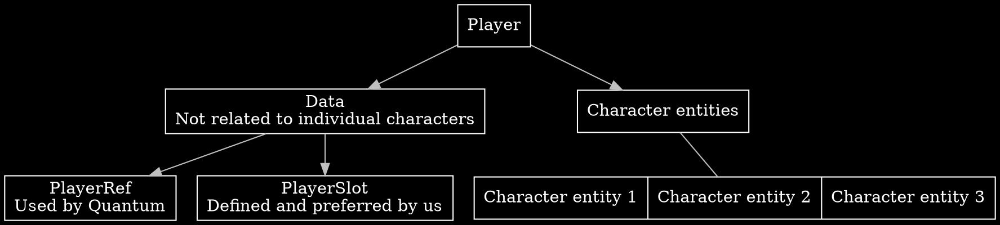
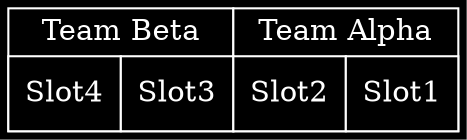
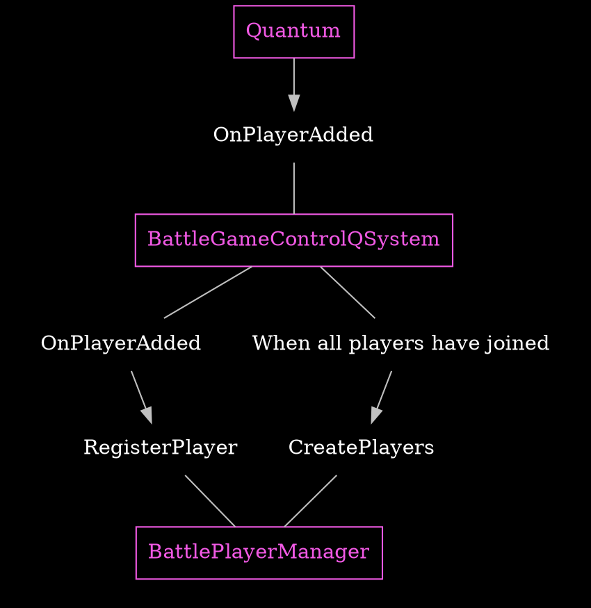
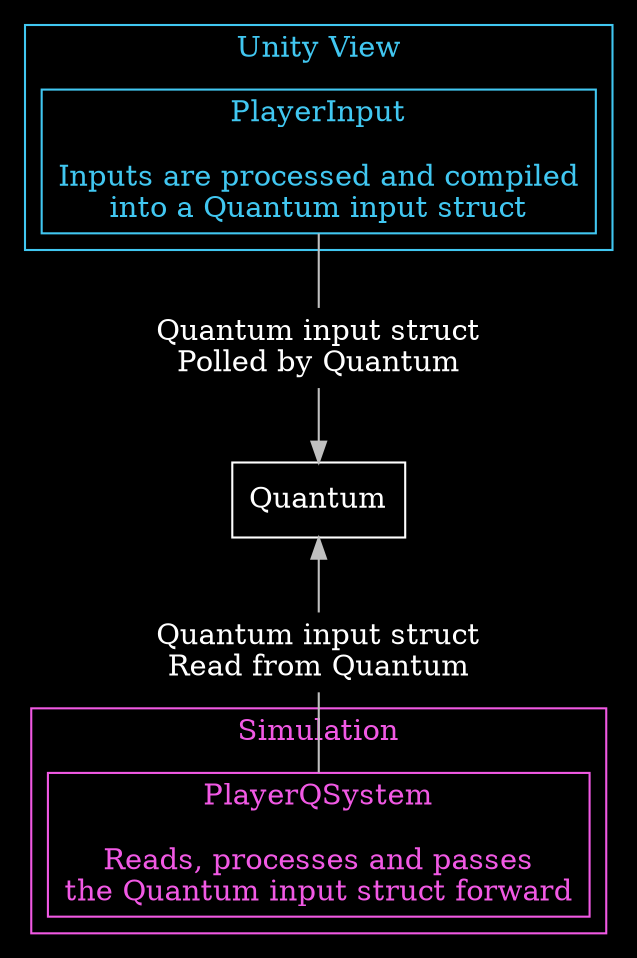
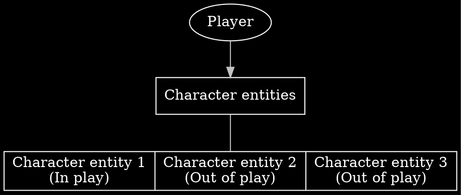
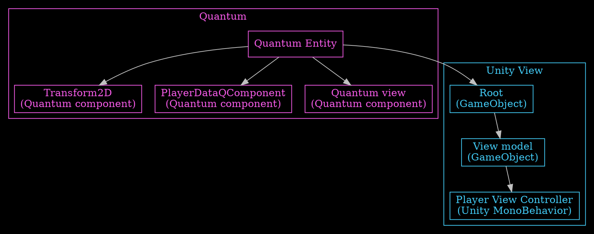
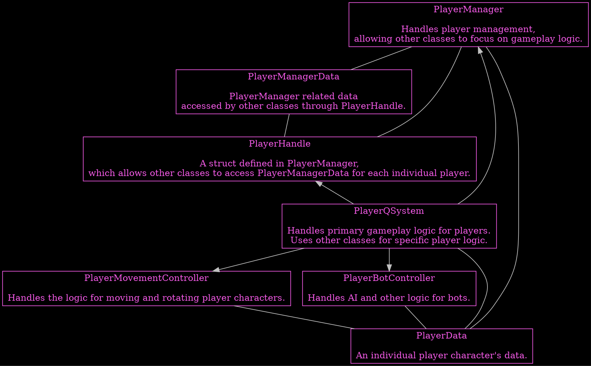

# Player concepts {#page-concepts-player}
%Quantum handles recognizing players through a [PlayerRef🡵](https://doc-api.photonengine.com/en/quantum/current/struct_quantum_1_1_player_ref.html), but we prefer to use **PlayerSlot** as defined by us whenever possible.  
Each player has data with them that isn't connected to any specific character under the player's control.  
Each player controls multiple character entities.  
See [{Player slots and teams}](#page-concepts-player-slots-teams)  
See [{Player manager data}](#page-concepts-player-manager-data)  
See [{Player character entity}](#page-concepts-player-character-entity)

## Player slots and teams {#page-concepts-player-slots-teams}
Each player has an assigned @cref{Quantum,BattlePlayerSlot} and a @cref{Quantum,BattleTeamNumber}.  
The possible slots are 1-4.  
The teams are TeamAlpha and TeamBeta.  
Players in slots 1 and 2 are in TeamAlpha and players in slots 3 and 4 in TeamBeta.  
Guest and Spectator slots also exist, but are not currently used in %Battle.  
The enums for player slots and teams are defined in [{Simulation}](#page-concepts-player-simulation).

 

## Player manager data {#page-concepts-player-manager-data}
Player data not connected to individual player characters is handled by @cref{Battle.QSimulation.Player,BattlePlayerManager}.  
The [{PlayerManagerData}](#page-concepts-player-simulation-playermanagerdata) %Quantum singleton component is used to store player data.
The [{PlayerHandle}](#page-concepts-player-simulation-playerhandle) struct allows the code to access player manager data of specific individual players.  
Player manager data is defined and used in [{Simulation}](#page-concepts-player-simulation).

 

## Joining and initializing {#page-concepts-player-initializing}
%Quantum handles players connecting to the game. The data from %Quantum is used to initialize everything related to players in the game.
@cref{Battle.QSimulation.Game,BattleGameControlQSystem} receives player information from %Quantum when a player joins and passes it to @cref{Battle.QSimulation.Player,BattlePlayerManager}, which processes the player's data and registers them as having joined.

Once all players have joined, @cref{Battle.QSimulation.Game,BattleGameControlQSystem} tells @cref{Battle.QSimulation.Player,BattlePlayerManager} to create [{Player character entities}](#page-concepts-player-character-entity) for all players.

 

## PlayerInput {#page-concepts-player-input}
Players can interact with the game through moving and rotating their character, as well as switching between their available characters.  
Player inputs are processed and compiled into a @ref Quantum.Input "Quantum input struct" on the Unity/View side in @cref{Battle.View.Player,BattlePlayerInput}. The created struct is passed over to %Quantum.  
%Quantum synchronises the struct for all connected clients, and classes on the [{Quantum simulation}](#page-concepts-player-simulation) side use the contained data.

See [Input🡵](https://doc.photonengine.com/quantum/current/manual/input) %Quantum's documentation for more info.

 

## Player character entity {#page-concepts-player-character-entity}
Each player controls three character %Quantum entities in the game.  
For each player one character is present on the stage at a time and @cref{Battle.QSimulation.Player,BattlePlayerManager} handles spawning and despawning character entities when switching between them.

These entities are created based on Unity prefabs. Entities are controlled by %Quantum simulation.  
The Unity prefab root GameObject contains a %Quantum entity prototype component, where the entity is defined.

During gameplay the player character exists both as a %Quantum entity inside [{Simulation}](#page-concepts-player-simulation) and a Unity gameObject inside **Unity View**. %Quantum links the gameObject and entity together.  
The entity contains %Quantum components used by the %Quantum simulation. The most significant of these is the [{PlayerData (Quantum component)}](#page-concepts-player-simulation-playerdata), which is our own defined data relating to player character entities.  
The Unity root gameObject has the child object PlayerViewModel, containing all things related to the visible elements of player characters. The attached @cref{Battle.View.Player,BattlePlayerViewController} component implements **Unity View/Visual** logic for player characters.

 

---

 

## %Quantum simulation {#page-concepts-player-simulation}

 

### Overview {#page-concepts-player-simulation-overview}

 

### PlayerManagerData (%Quantum singleton) {#page-concepts-player-simulation-playermanagerdata}
The @cref{Quantum,BattlePlayerManagerDataQSingleton} struct is a %Quantum singleton component defined in and generated from BattlePlayerManagerData.qtn containing all our defined data for players. [{PlayerHandle}](#page-concepts-player-simulation-playerhandle) is used to access this data for each individual player.

 

### PlayerManager {#page-concepts-player-simulation-playermanager}

 

### PlayerHandle {#page-concepts-player-simulation-playerhandle}
The @cref{Battle.QSimulation.Player.BattlePlayerManager,PlayerHandle} struct defined in @cref{Battle.QSimulation.Player,BattlePlayerManager} allows the code to access [{Player manager data}](#page-concepts-player-manager-data) of each individual player.

There is both a private @cref{Battle.QSimulation.Player.BattlePlayerManager,PlayerHandleInternal} struct containing all the data for use internally within @cref{Battle.QSimulation.Player,BattlePlayerManager}, and the public @cref{Battle.QSimulation.Player.BattlePlayerManager,PlayerHandle} exposing some parts to the rest of the game.

 

### PlayerData (%Quantum component) {#page-concepts-player-simulation-playerdata}
The @cref{Quantum,BattlePlayerDataQComponent} struct is defined in and generated from BattlePlayerData.qtn. This contains data specific to each [{Player character entity}](#page-concepts-player-character-entity) used by the %Quantum simulation during gameplay.

 

### PlayerQSystem {#page-concepts-player-simulation-playerqsystem}
@cref{Battle.QSimulation.Player,BattlePlayerQSystem} contains the primary %Quantum player logic. This %Quantum system contains code for handling collisions and the update method for player characters.
Other classes are utilized for specific aspects of player logic.
See [{PlayerMovementController}](#page-concepts-player-simulation-playerqsystem-movement-controller)
See [{PlayerBotController}]()

 

### PlayerMovementController {#page-concepts-player-simulation-playerqsystem-movement-controller}
@cref{Battle.QSimulation.Player,BattlePlayerMovementController} contains the primary @cref{Battle.QSimulation.Player.BattlePlayerMovementController,UpdateMovement} method which handles player movement, and is called by [{BattlePlayerQSystem}](#page-concepts-player-simulation-playerqsystem).
Also contains individual helper methods for moving and rotating players, which can be used by other scripts.

 

### PlayerBotController {#page-concepts-player-simulation-botcontroller}

 

---

 

### Character classes {#page-concepts-player-characters-classes}
Player character classes function by having implementable methods that are called in certain situations during a game, such as when a projectile collides with a player character. Classes can also implement an update method. These methods can be used to implement functionality on top of for example the default collision methods to change how different character classes function.

Character classes are implemented by creating a unique class that inherits one of the two BattlePlayerClassBase classes defined in BattlePlayerClassManager.cs. These classes can choose to implement any of the available methods for functionality. Character classes can also optionally have a data QComponent for additional data the class will use.

Scripts such as BattlePlayerQSystem call methods in BattlePlayerClassManager, which then in turn call the corresponding method for the character class of the specified player character. This way each characters possible character class methods are always correctly called.

 

---