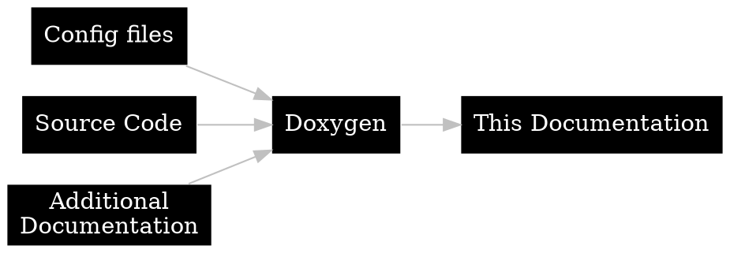
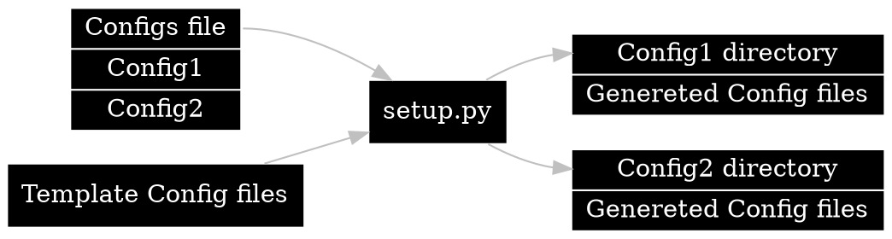

# Documentation {#page-documentation}

**%Battle** uses [Doxygen🡵] to generate [this documentation](./index.html) from the **source code** and **additional documentation** files.

[Doxygen🡵] **configuration**, **additional documentation** and the **generated output** are in the @dirref{Altzone/Doc/Doxygen/Battle} directory.

 

## Configuration/Setup {#page-documentation-configuration}

[Doxygen🡵] **configuration files** are generated using a **python** script called `setup.py`.  
`setup.py` reads a file called `configs`.  
The `configs` file defines **configs** and **variables** for each **config**.  
Files other than the `configs` file and `setup.py` itself are used as **templates**.  
`setup.py` generates a directory for each **config** defined in the `configs` file.  
The **template files** are copied to each **config**, during which **variables** are substituted for their values.  
The **generated configurations** are gitingored.

The [Doxygen🡵] **configurations** used in **%Battle** are
- **config**  
  Main configuration.  
  This configuration should be used when generating the official **%Battle** Documentation.
- **config-test**  
  Same as **config** but outputs to a gitingored directory.  
  This configuration is for testing when writing documentation.
- **config-test-nodot**  
  Same as **config-test** but has **HAVE_DOT** set to NO.  
  This configuration is for generating documentation when [Graphviz🡵] is not installed.

 

## Generating Documentation {#page-documentation-generating}

- **First run the setup script if you haven't done it yet or the configuration files has changed.**  
  *In terminal*
  1. Change directory to `Altzone/Doc/Doxygen/Battle/setup`.
  2. Run `python setup.py`.

- **Run Doxygen**  
  *In terminal*
  1. Change directory to `Altzone/Doc/Doxygen/Battle/(config name)`.  
     There are multiple configurations you can choose from.
  2. Run `doxygen`.

 

---

@subpage page-documentation-doxygen

@subpage page-documentation-documenting-source-code

@subpage page-documentation-codegen

@subpage page-documentation-pages

@subpage page-documentation-additional

---

[Doxygen🡵]:  https://www.doxygen.nl/index.html
[Graphviz🡵]: https://www.doxygen.nl/manual/config.html#cfg_have_dot