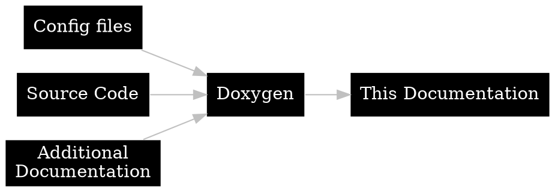
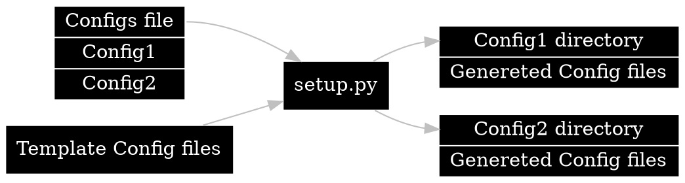

# Documentation {#page-documentation}

%Battle uses [Doxygen🡵] to generate [this documentation](./index.html) from the source code and additional documentation files.



[Doxygen🡵] configuration, additional documentation and the generated output are in the @dirref{Altzone/Doc/Doxygen/Battle} directory.

<br/>

## Configuration/Setup {#page-documentation-configuration}

[Doxygen🡵] configuration files are generated using a python script called setup.py.  
setup.py reads a file called configs.  
The configs file defines configs and variables for each config.  
Files other than the configs file and setup.py itself are used as templates.  
setup.py generates a directory for each config defined in the configs file.  
The template files are copied to each config, during which variables are substituted for their values.  
The generated configurations are gitingored.



The [Doxygen🡵] configurations used in %Battle are
- **config**  
  Main configuration.  
  This configuration should be used when generating the official %Battle Documentation.
- **config-test**  
  Same as config but outputs to a gitingored directory.  
  This configuration is for testing when writing documentation.
- **config-test-nodot**  
  Same as config-test but has HAVE_DOT set to NO.  
  This configuration is for generating documentation when [Graphviz🡵] is not installed.

<br/>

## Generating Documentation {#page-documentation-generating}

- **First run the setup script if you haven't done it yet or the configuration files has changed.**  
  *In terminal*
  1. Change directory to `Altzone/Doc/Doxygen/Battle/setup`.
  2. Run `python setup.py`.

- **Run Doxygen**  
  *In terminal*
  1. Change directory to `Altzone/Doc/Doxygen/Battle/(config name)`.  
     There are multiple configurations you can choose from.
  2. Run `doxygen`.

<br/>

---

## External Hyperlink format {#page-external-hyperlink-format}

Markdown
```
[link text🡵](url)
[link text🡵]: url
```

C# Doc Comment / HTML
```
<see href="url">link text@u-exlink</>
<a href="url">link text@u-exlink</a>
```

@note 
External links should have the "🡵" unicode character or @@u-exlink at the end

@important
In source code @@u-exlink should be used instead of "🡵"

<br/>

## Doxygen custom commands {#page-doxygen-custom-commands}
Doxygen [Custom commands🡵] that can be used during documentation are defined in @ref Altzone/Doc/Doxygen/Battle/setup/Doxyfile under the ALIASES section. These are defined by us to add useful shorthands. All added custom commands should be listed on this page.

<br/>

### Reference links
These [Custom commands🡵] can be used to make linking to directories and code symbols easier.  

List of current aliases  

**Directory reference / link aliases**
- **dirref**  
  Note where the "/" is replaced with a ","
  - Basic reference  
    <span class="tt">@@dirref{very/long/example/path}</span>  
    Creates a link to the specified directory.  
    Formatted as such: "very/long/example/path"
  - Short reference  
    <span class="tt">@@dirref{very/long,example/path}</span>   
    Creates a link to the specified directory. Shortens the resulting text.  
    Formatted as such: "example/path"
  - Middle truncated reference  
    <span class="tt">@@dirref{very,long/example,path}</span>  
    Creates a link to the specified directory. Truncates the resulting text.  
    Formatted as such: "very/../path"
- **dirrefr**  
  Note where the "/" is replaced with a ","
  - Relative reference  
    <span class="tt">@@dirrefr{very/long,example/path}</span>  
    Creates a link to the specified directory. Used when referencing another directory in the same parent directory.  
    Formatted as such: "../path"
- **dirlink**
  -  Directory link  
    <span class="tt">@@dirlink{very/long/example/path:link text}</span>  
    Creates a link to the specified directory with arbitrary text.  
    Formatted as such: "link text"

**Code symbol aliases**
- **cref**  
  Note where the "." is replaced with a ","
  - Basic reference 
    <span class="tt">@@cref{namespace.example.name}</span>  
    Creates a link to the specified code symbol.  
    Formatted as such: "namespace.example.name"
  - Short reference  
    <span class="tt">@@cref{namespace.example,name}</span>  
    Creates a link to the specified code symbol. Shortens the resulting text.  
    Formatted as such: "name"
- **crefd**  
  Note where the "." is replaced with a ","
  - Basic reference with dot  
    <span class="tt">@@crefd{namespace.example.name}</span>  
    Creates a link to the specified code symbol. Adds a dot to the end of the resulting text.  
    Formatted as such: "namespace.example.name."
  - Short reference with dot  
    <span class="tt">@@crefd{namespace.example,name}</span>  
    Creates a link to the specified code symbol. Shortens the resulting text. Adds a dot to the end of the resulting text.  
    Formatted as such: "name."

<br/>

### Documentation links
These [Custom commands🡵] can be used for simplified linking to other sections of documentation.  

List of current documentation link aliases  

| Alias             | Text         | documentation index      |
| :---------------- | :----------- | :----------------------- | 
| @@systemslink     | Systems      | #page-simulation-systems |
| @@uihandlerlink   | UI Handler   | #page-view-uihandler     |
| @@uihandlerslink  | UI Handlers  | #page-view-uihandler     |
| @@uicomponentlink | UI Component | #page-view-uicomponent   |

They are defined as such:
```
(name)="[(Visible text)]{(documentation section index)}" \

example:
uihandlerlink="[UI Handler](#page-view-uihandler)" \
```

<br/>

### Extra formatting
These [Custom commands🡵] allow for easier formatting of our text.

List of current formatting aliases

| Alias                   | Description        |
| :---------------------- | :----------------- | 
| @@bigtext{example text} | Makes the text big |

<br/>

### Circumventing unicode characters
These [Custom commands🡵] are useful in avoiding the use of unicode characters in source code.  

Usage/syntax:  
u stands for unicode.  
(name) is the name of the unicode character as specified by us usually based on what the symbol represents in our documentation.
```
@u-(name)
```

List of current unicode aliases

| Alias      | Character | Description          |
| :--------- | :-------- | :------------------- | 
| @@u-exlink | 🡵        | external link symbol |

They are defined as such:
```
u-(name)="(unicode character)"

example:
u-exlink="🡵"
```

<br/>

---

## Documenting Source code {#page-documenting-source-code}
All aspects of source code, such as files, methods and variables, should be documented with clear and concise information. Different sections of the documentation for each should be separated by an empty line.  
Unicode characters can not be used inside of source code, even in documentation comments.  

Refer to the [Documenting Quantum systems](#page-documenting-quantum-systems) section for additional guidelines if you are documenting a %Quantum system.  
Refer to the [Documenting Unity/View](#page-documenting-unity-view) section for additional guidelines if you are documenting Unity/View code.

<br/>

### Documenting Files
File documentation should have a reference to the file, a summary and possible longer information as its own section.

```
/// @file BattlePlayerMovementController.cs
/// <summary>
/// Handles player input, movement and rotations.
/// </summary>
///
/// Gets player's Quantum.Input and updates player's position and rotation depending on player's actions.
/// Handles moving, rotating and teleporting players and all their hitboxes.
```

<br/>

### Documenting Classes
Classes should be documented with a summary.

```
/// <summary>
/// Handles player input, movement and rotations.
/// </summary>
public static unsafe class BattlePlayerMovementController
```

<br/>

### Documenting Methods
When documenting any method, the different sections of the comment such as the summary, parameters and return value should be separated by an empty line.

```
/// <summary>
/// Clamps the grid position of the player to the playfield of their team.
/// </summary>
///
/// <param name="playerData">Pointer to the player's data component.</param>
/// <param name="gridPosition">The grid position of the player.</param>
/// <param name="clampedPosition">The resulting clamped position of the player.</param>
/// 
/// <returns>True if the position changed from clamping, false if it remained the same.</returns>
```

<br/>

### Documenting public getters
The format used for documenting public getters for private variables. Using both summary and value tags so that in doxygen it's clear that it's a getter for another variable, and in code it's clear what it's value is.

```
/// <summary>Public getter for #_rectTransform.</summary>
/// <value>Reference to the %Battle Ui element's <a href="https://docs.unity3d.com/2022.3/Documentation/ScriptReference/RectTransform.html">RectTransform@u-exlink</a> component.</value>
public RectTransform RectTransformComponent => _rectTransform;
```

<br/>

### Documenting variables
Variables should be documented with a summary.

```
/// <summary>Reference to the %Battle Ui element's <a href="https://docs.unity3d.com/2022.3/Documentation/ScriptReference/RectTransform.html">RectTransform@u-exlink</a> component.</summary>
private RectTransform _rectTransform;
```

<br/>

---

## Documenting Quantum Systems {#page-documenting-quantum-systems}
The base [Documenting source code](#page-documenting-source-code) guidelines apply to %Quantum system documentation. Below are additional guidelines for specifically formatting %Quantum system documentation.  
In the examples parameter documentation has been ommitted.

<br/>

### Quantum System Class brief/summary format
The format used for documenting System and SystemSignalsOnly classes. Must contain the header with the correct system name and link to %Quantum documentation.

System

```
/// <summary>
/// <span class="brief-h">%Diamond <a href="https://doc.photonengine.com/quantum/current/manual/quantum-ecs/systems">Quantum System@u-exlink</a> @systemslink</span><br/>
/// Handles spawning diamonds, managing their lifetime and destroying them.
/// </summary>
public unsafe class BattleDiamondQSystem : SystemMainThreadFilter<BattleDiamondQSystem.Filter>, ISignalBattleOnProjectileHitSoulWall, ISignalBattleOnDiamondHitPlayer
```

SystemSignalsOnly

```
/// <summary>
/// <span class="brief-h">%Goal <a href="https://doc.photonengine.com/quantum/current/manual/quantum-ecs/systems">Quantum SystemSignalsOnly@u-exlink</a> @systemslink</span><br/>
/// Triggers the end of the game when it receives signal
/// </summary>
public unsafe class BattleGoalQSystem : SystemSignalsOnly, ISignalBattleOnProjectileHitGoal
```

<br/>

### Quantum System OnInit method brief/summary format
The format used for documenting %Quantum OnInit methods. Must contain the header with the link to %Quantum documentation. Must also contain the appropriate warning message.

```
/// <summary>
/// <span class="brief-h"><a href="https://doc.photonengine.com/quantum/current/manual/quantum-ecs/systems">Quantum System OnInit method</a> gets called when the system is initialized.</span><br/>
/// Initializes the arena, player system, and sets the game session as initialized.
/// @warning
/// This method should only be called by Quantum.
/// </summary>
public override void OnInit(Frame f)
```

<br/>

### Quantum System Update method brief/summary format
The format used for documenting %Quantum Update methods. Must contain the header with the link to %Quantum documentation. Must also contain the appropriate warning message.

```
/// <summary>
/// <span class="brief-h"><a href="https://doc.photonengine.com/quantum/current/manual/quantum-ecs/systems">Quantum System Update method</a> gets called every frame.</span><br/>
/// Controls state transitions of the game session per frame. Manages countdowns and progression to 'Playing'.
/// @warning
/// This method should only be called by Quantum.
/// </summary>
public override void Update(Frame f)
```

<br/>

### Quantum System Signal method brief/summary format
The format used for documenting %Quantum Signal methods. Must contain the header with the link to %Quantum documentation and a reference to the signal the method responds to. Must also contain the appropriate warning message.

```
/// <summary>
/// <span class="brief-h"><a href="https://doc.photonengine.com/quantum/current/manual/quantum-ecs/systems">Quantum System Signal method@u-exlink</a>
/// that gets called when <see cref="Quantum.ISignalBattleOnProjectileHitPlayerShield">ISignalBattleOnProjectileHitPlayerShield</see> is sent.</span><br/>
/// Handles behavior when the projectile hits a player shield.<br/>
/// Applies bounce logic based on surface normal of the shield hitbox.
/// @warning
/// This method should only be called via Quantum signal.
/// </summary>
public void BattleOnProjectileHitPlayerShield(Frame f, BattleProjectileQComponent* projectile, EntityRef projectileEntity, BattlePlayerHitboxQComponent* playerHitbox, EntityRef playerHitboxEntity)
```

<br/>

---

## Documenting Unity/View {#page-documenting-unity-view}
The base [Documenting source code](#page-documenting-source-code) guidelines apply to Unity/View documentation. Below are additional guidelines for specifically formatting Unity/View documentation.

<br/>

### Documenting SerializeFields
The format used for grouping SerializeFields. Example provided also has SerializeField summary documentation.
- Anchor name is in format ClassName-SerializeFields.
- Make sure that the header is copied entirely, and the example comments starting with two slashes // are removed.
- Place all SerializeField variables inside the group.
- SerializeField variable documentation should be on a single line, use summary tags and have "[SerializeField] " prefix.

```
/// @anchor BattleUiJoystickHandler-SerializeFields // Anchor name
/// @name SerializeField variables // The group name
/// <a href="https://docs.unity3d.com/2022.3/Documentation/ScriptReference/SerializeField.html">SerializeFields@u-exlink</a> are serialized variables exposed to the Unity editor. // Group description
/// @{ // Start of the grouped SerializeFields

/// <summary>[SerializeField] Reference to BattleUiController.</summary> // SerializeField summary documentation
/// @ref BattleUiMovableJoystickElement-SerializeFields // Anchor reference
[SerializeField] private BattleUiController _uiController; // SerializeField variable

/// @} // End of the grouped SerializeFields
```

<br/>

### UI Handler class method brief/summary format
```
<span class="brief-h">handler name @uihandlerlink (<a href="https://docs.unity3d.com/ScriptReference/MonoBehaviour.html">Unity MonoBehaviour script@u-exlink</a>).</span><br/>
// brief text
```

<br/>

---

## Prefabs and Entity Prototypes {#page-prefabs-and-entity-prototypes}

### Prefab summary format

Prefab summary doesn't have a strict format that needs to be used, but it needs to be kept relatively short.

### Entity Prototype format

Entity Prototype summary has a link to its prefab counterpart. The template below is all that is needed to document Entity Prototypes.<br/>

```
/// @file filename.qprototype
/// <summary>
/// EntityPrototype counterpart of @ref prefabfilename.prefab -
/// @copybrief prefabfilename.prefab
/// </summary>
///
/// Contains data about the prefab that %Quantum needs (QComponents used in prefab etc.).
```

At the moment Entity Prototype documentation can be found in <i>%Altzone/Doc/Doxygen/Battle/code-structure</i> folder in prefab.dox and playerprefab.dox files.  
Entity Prototype documentation is paired with their prefab's documentation and is located below it.  

### Prefab Structure format

Prefabs need to have their structure documented. 

Structure documentation follows these rules:
- Structure is listed as a bullet list.
- GameObject names are bolded.
- Components and Children -titles are italicized.
- Component names are regular text style.
- Material components have (Material) after their name.
- If component is a %Quantum Entity Prototype and it has QComponents, those are listed below it on the next level of indentation. They also link to the QComponent's documentation.
- ViewControllers and other components with documentation have a link to their class documentation. Links are on the same level of indentation with other components.
- If another prefab is used as a child GameObject, its prefab is linked in brackets after the GameObject's name.
- If all of the child GameObjects on the same indentation level have same components, Shared components -title is used at the same indentation level as the gameobjects it refers to. Shared components are listed below the title on the next indentation level. If there is only few child GameObjects and/or few components, this rule doesn't need to be strictly followed.
- If all of the child GameObjects on the same indentation level have same children, Shared children -title is used at the same indentation level as the gameobjects it refers to. Shared children are listed below the title on the next indentation level.
- If there is multiple identical child GameObjects with consecutive numbering, they can be listed only once and the number range can be placed inside curly braces.
- Other parts of names can also be replaced with words inside curly braces if needed, but this needs to be used sparingly in order to keep the structure documentation as simple and cohesive as possible.

#### Basic template for documenting prefab structures:
```
/// ### Structure
/// - **GameObject**
///     - *Components:*
///         - Component1
///         - Component2
///     - *Children:*
///         - **ChildGameObject**
///             - *Components:*
///                 - Component1
///                 - Component2
```
<br/>

#### Example snippets of different rules implemented:

Example of QComponent links:
```
/// - *Components:*
///     - Transform
///     - %Quantum Entity Prototype
///         - @cref{Quantum,BattleSoulWallQComponent}
///         - @cref{Quantum,BattleCollisionTriggerQComponent}
///     - %Quantum Entity View
```
<br/>

Example of ViewController link:
```
/// - *Components:*
///     - Transform
///     - @cref{Battle.View.Projectile,BattleProjectileViewController}
///     - SpriteRenderer
```
<br/>

Example of prefab used as a Child GameObject:
```
/// - *Children:*
///     - **BattleUiTimer** (@ref BattleUiTimer.prefab)
///     - **AnnouncementText**
```
<br/>

Example of shared components and shared children:
```
/// - *Children:*
///     - **ImpactForceHolder**
///     - **HpHolder**
///     - **SpeedHolder**
///     - **CharSizeHolder**
///     - **DefenceHolder**
///     - *Shared components:*
///         - RectTransform
///     - *Shared children:*
///         - **StatName**
///         - **StatValue**
///         - *Shared components:*
///             - RectTransform
///             - CanvasRenderer
///             - TextMeshPro - Text (UI)
```
On the example above, all -Holder children have RectTransform component and they all have StatName and StatValue children. All StatName and StatValue children have the shared components listed below them.

<br/>

Example of GameObjects with consecutive numbering:
```
/// - *Children:*
///     - **BattleLightrayBlue**{ **1** - **10** }
///     - **BattleLightrayRed**{ **1** - **10** }
```

<br/>

Example of other parts of names replaced with curly braces:
```
/// - *Children:*
///     - **CharacterTopBase**
///     - **CharacterBottomBase**
///     - *Shared components:*
///         - Transform
///         - SpriteRenderer
///         - Sprites-Default (Material)
///     - *Shared children:*
///         - **Character**{ **Top** - **Bottom** } **Background**
///         - **Character**{ **Top** - **Bottom** } **Piece**{ **01** - **10** }
///         - *Shared components:*
///             - Transform
///             - SpriteRenderer
///             - Sprites-Default (Material)
///         - *Shared children:*
///             - **Character**{ **Top** - **Bottom** } **PieceWhite**{ **01** - **10** }
///             - *Shared components:*
///                 - Transform
///                 - SpriteRenderer
```
On the example above, Top and Bottom have been placed inside curly braces on shared children, because there is so many shared children that also have more shared children with the same naming style and shared components.  
Note: There is space between the closing curly braces and rest of the names, because doxygen doesn't recognize asterisks after the brace without it. On the original GameObject name there is no space.

[Doxygen🡵]:  https://www.doxygen.nl/index.html
[Custom commands🡵]: https://www.doxygen.nl/manual/custcmd.html
[Graphviz🡵]: https://www.doxygen.nl/manual/config.html#cfg_have_dot